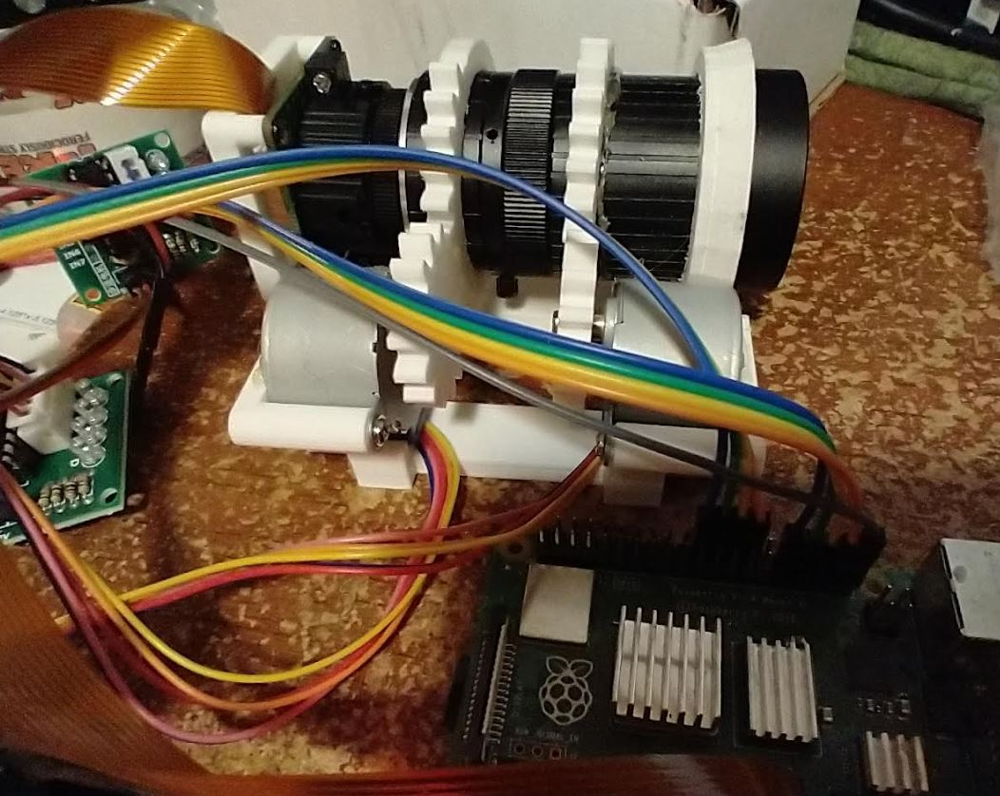

### About

An auto-zoom hat-mounted camera using Raspberry Pi HQ cam and ML for rc plane detection

### Note

Try to avoid using `GPIO 1` this affects the camera (not detected).

It can be avoided if you don't have a shared ground connected but requires a switch until after boot.
