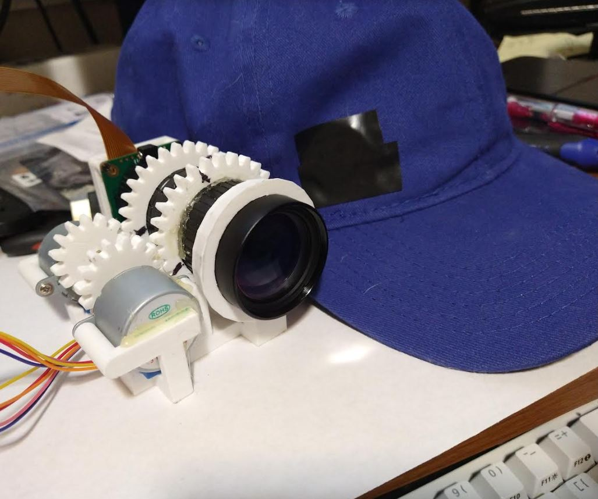

### About

An auto-zoom hat-mounted camera using Raspberry Pi HQ cam and ML for rc plane detection

### Note

Try to avoid using `GPIO 1` this affects the camera (not detected).

It can be avoided if you don't have a shared ground connected but requires a switch until after boot.

### Progress
- [ ] physical body
  - [x] usable lens focus/tele assembly (01/27/2023)
  - [ ] display and dpad
  - [ ] full design (attachable to hat)
- [ ] functionality code
  - [ ] steppers and position tracking
    - [x] motion (01/28/2023)
    - [ ] track in db for boot resume
  - [ ] menu design
  - [ ] dpad bindings
- [ ] auto zoom
  - [ ] some method like comparing frames, more blurry go other way
  - basic mask frame by frame find contours
- [ ] machine learning
  - train small shots of plane sillhouette against wall
