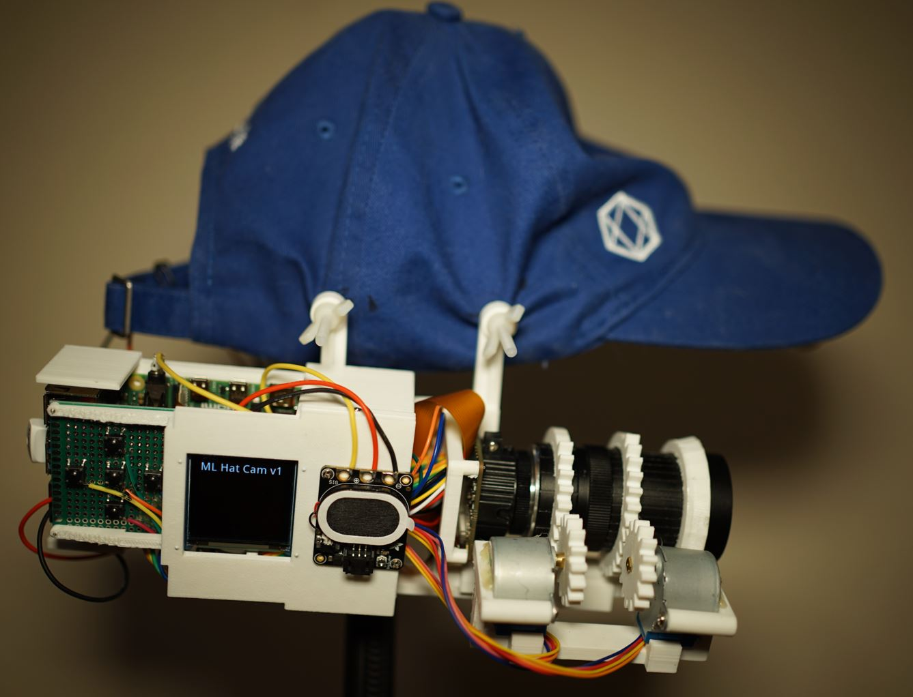
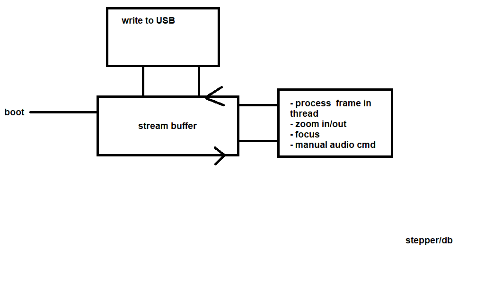

### About

An auto-zoom hat-mounted camera using an Arducam IMX477 with 8-50mm lens and ML for rc plane detection

### Current capabilities
- record video, write to USB
- record audio, write to USB
- dpad with display (basic menus)
- zoom and position (db)
- autofocus (variance, needs work)
- battery life tracking

### Unit cost $235+

Major parts (more than $1 each)

| Name                           | Cost             |
| ------------------------------ | ---------------- |
| RPi 4B 4GB                     | $55 (originally) |
| Arducam 12.3MP IMX477          | $74.99           |
| Arducam 8-50mm lens            | $49.99           |
| 2x 28BYJ-48 Stepper            | $3 ea.           |
| 1.5in Waveshare OLED           | $18.59           |
| 2x Panasonic NCR18650B 3400mAh | $8.99 ea.        |
| Adafruit Speaker               | $5.95            |
| mEZD41503A-A step-up converter | $14.33           |

### ML Capable Yet?

No

### Development progress

[see task list](/tasks.md)

### System block diagram (needs to be updated when final state determined)

### Raspberry Pi 4B GPIO pin usage

| Left            | Right           |
| --------------- | --------------- |
| 3.3V            | 5V              |
| GPIO 2          | 5V              |
| GPIO 3          | Ground          |
| GPIO 4          | GPIO 14         |
| Ground          | GPIO 15         |
| GPIO 17         | GPIO 18         |
| GPIO 27         | Ground          |
| GPIO 22         | GPIO 23         |
| 3.3V            | **GPIO 24 [I]** |
| **GPIO 10 [D]** | Ground          |
| **GPIO 9 [D]**  | **GPIO 25 [D]** |
| **GPIO 11 [D]** | **GPIO 8  [D]** |
| Ground          | **GPIO 7  [I]** |
| **GPIO 0  [I]** | **GPIO 1  [I]** |
| **GPIO 5  [I]** | Ground          |
| **GPIO 6  [S]** | **GPIO 12 [S]** |
| **GPIO 13 [S]** | Ground          |
| **GPIO 19 [S]** | **GPIO 16 [S]** |
| **GPIO 26 [S]** | **GPIO 20 [S]** |
| Ground          | **GPIO 21 [S]** |

Legend

- Steppers [S]
- Display [D] (uses 3.3V Linear Regulator for power)
- dpad [I] (input)

### Note

Avoid using `GPIO 1` this affects the camera (not detected).

It can be avoided if you don't have a shared ground connected but requires a switch until after boot.

### Disclaimer

Most of the physical dimensions on part models are not 100% accurate. They are for modeling the major dimensions for mounting/fitting in terms of volume.

This project might be a fail just because of how heavy/cumbersome it is.

A different approach is to use a tripod, ground-based tracker. Whether it tracks on its own or you aim with your head. The self-tracking sounds more interesting.
