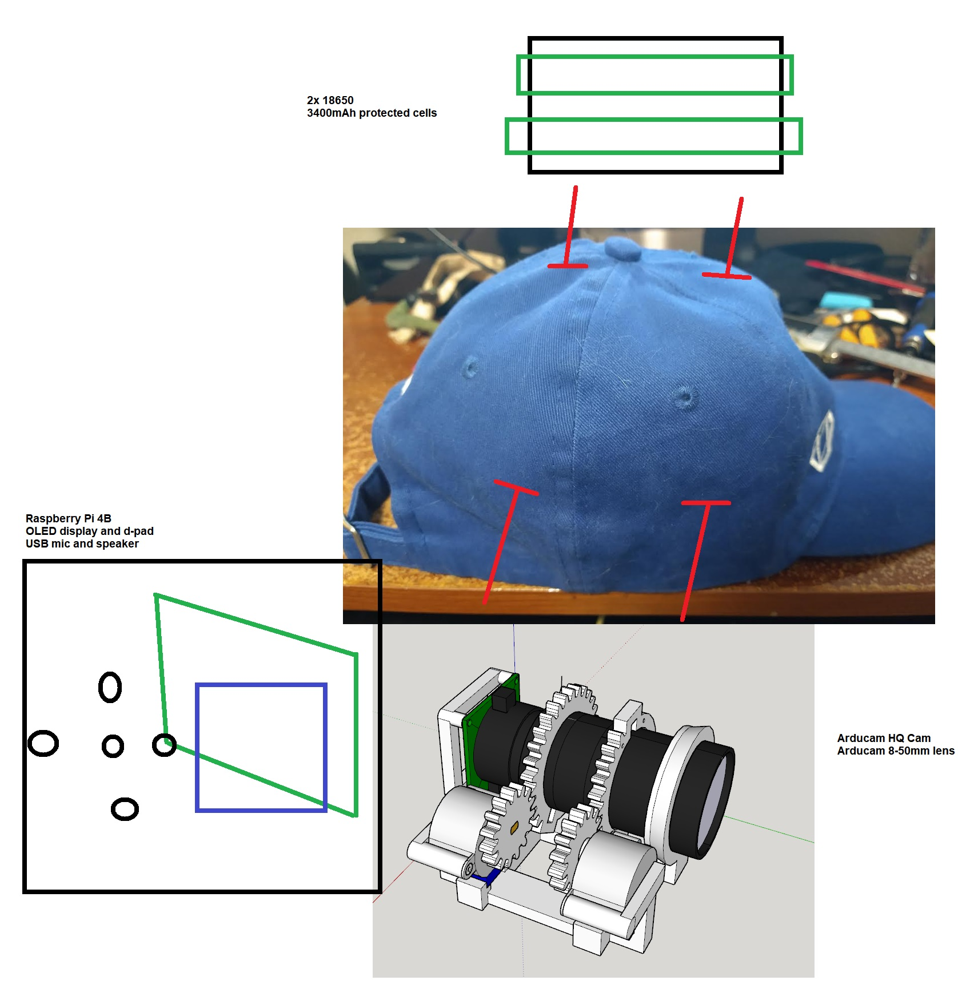

### About

An auto-zoom hat-mounted camera using an Arducam IMX477 with 8-50mm lens and ML for rc plane detection

### The vision

### Note

Try to avoid using `GPIO 1` this affects the camera (not detected).

It can be avoided if you don't have a shared ground connected but requires a switch until after boot.

### Progress
- [ ] physical body
  - [x] usable lens focus/tele assembly (01/27/2023)
  - [ ] display and dpad
  - [ ] full design (attachable to hat)
- [ ] functionality code
  - [x] steppers and position tracking (02/09/2023)
    - [x] motion (01/28/2023)
    - [x] track in db for boot resume (02/09/2023)
  - [ ] menu design
  - [ ] dpad bindings
- [x] auto focus (02/12/2023)
  - [x] some method like comparing frames, more blurry go other way
    - used laplace variance
- [ ] auto zoom
  - use ML to find target, then zoom
- [ ] machine learning
  - train small shots of plane sillhouette against wall
  - record actual flying footage, label samples, train model

### Raspberry Pi 4B GPIO pin usage

| Left        | Right       |
| ----------- | ----------- |
| 3.3V        | 5V          |
| GPIO 2      | 5V          |
| GPIO 3      | Ground      |
| GPIO 4      | GPIO 14     |
| Ground      | GPIO 15     |
| GPIO 17     | GPIO 18     |
| GPIO 27     | Ground      |
| GPIO 22     | GPIO 23     |
| 3.3V        | GPIO 24     |
| GPIO 10 [D] | Ground      |
| GPIO 09 [D] | GPIO 25 [D] |
| GPIO 11 [D] | GPIO 8  [D] |
| Ground      | GPIO 7      |
| GPIO 0      | GPIO 1      |
| GPIO 5      | Ground      |
| GPIO 6  [S] | GPIO 12 [S] |
| GPIO 13 [S] | Ground      |
| GPIO 19 [S] | GPIO 16 [S] |
| GPIO 26 [S] | GPIO 20 [S] |
| Ground      | GPIO 21 [S] |

Legend

- Steppers [S]
- Display [D] (uses 3.3V Linear Regulator for power)
