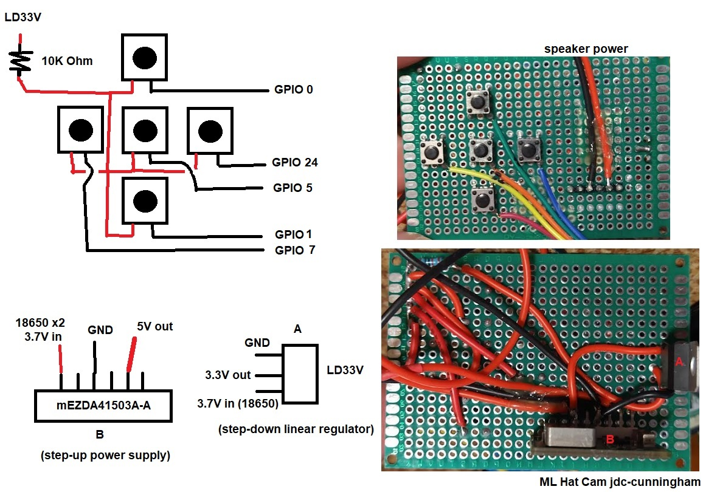

### About

Uses Waveshare 1.5 OLED SSD1351

This is the basic interface to select model, start recording, transfer files, etc...

### Wiring

This powers the RPi through 5V pin and shares ground.

### OLED wiring info (specific to this project)

|   OLED       | RPi Pin        |
| ------------ | -------------- |
| VCC (red)    | 3.3V           |
| GND (black)  | GND            |
| DIN (blue)   | GPIO 10 (MOSI) |
| CLK (yellow) | GPIO 11 (SCLK) |
| CS  (orange) | GPIO 8 (CE0)   |
| DC  (green)  | GPIO 9         |
| RST (white)  | GPIO 25        |

DC and RST set in `~/OLED_Module_Code/OLED_Module_Code/RaspberryPi/python/lib/waveshare_OLED/config.py`

### Menu info

Menu path/operation
- charged? (yes/no)
  - this updates the battery uptime counter/resets it
    alternative would be to use an ADC to read battery voltage but not needed

Need to
- match pins picked out in this repo
- enable SPI through `raspi-config` see resource below
- install library
  - installed in home directory eg. `~`
  - note: wiringpi 64bit deb
    - https://raspberrypi.stackexchange.com/questions/137316/how-to-install-wiringpi-on-raspbian
    - https://github.com/WiringPi/WiringPi/releases/tag/2.61-1
- first run
  - no module named smbus
    - install python3-smbus
  - make sure pins match, their example was using what looks like a Pi 3
    - set in config.py of waveshare_OLED folder
  - DC and reset pin for me

Resources
- https://www.waveshare.com/wiki/1.5inch_RGB_OLED_Module