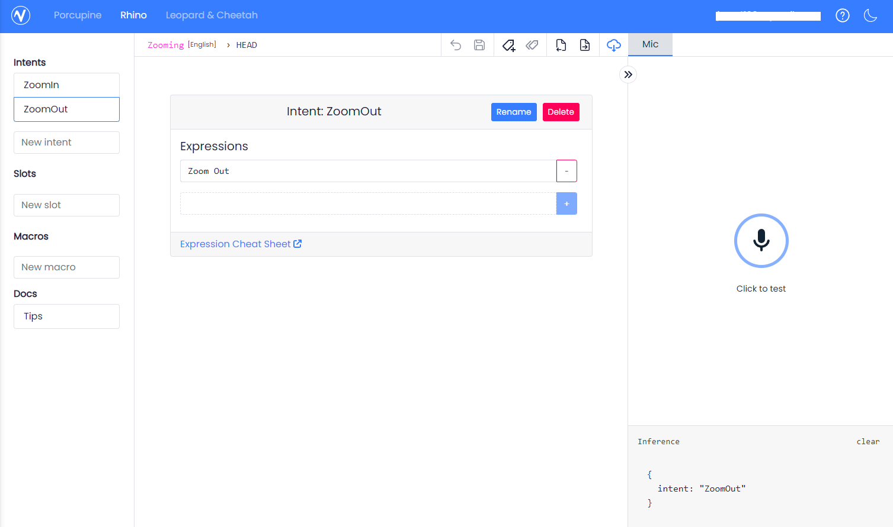

### Speech to intent

I am using Picovoice AI Rhino for these simple intents:

- zoom in
- zoom out

I made an account, I went on their site, went [here](https://console.picovoice.ai/rhn) to make my context (model)

Then I downloaded it after testing it in the browser

Install the demo see readme on [python](https://github.com/Picovoice/rhino)

Put it on the RPi so the demo command line call could reference it

`rhino_demo_mic --access_key ${ACCESS_KEY} --context_path ${CONTEXT_PATH}`

context_path is the path to the .rhn file

Then I execute this as a thread with references(callbacks) to functions fired by the intent, in this case zoom in or out (move stepper lens to certain positions eg. 0/mid/max)

See image for context

### About the implementation in this project

I installed the demo and I'm just using that demo comand line call and listening to the CLI out
