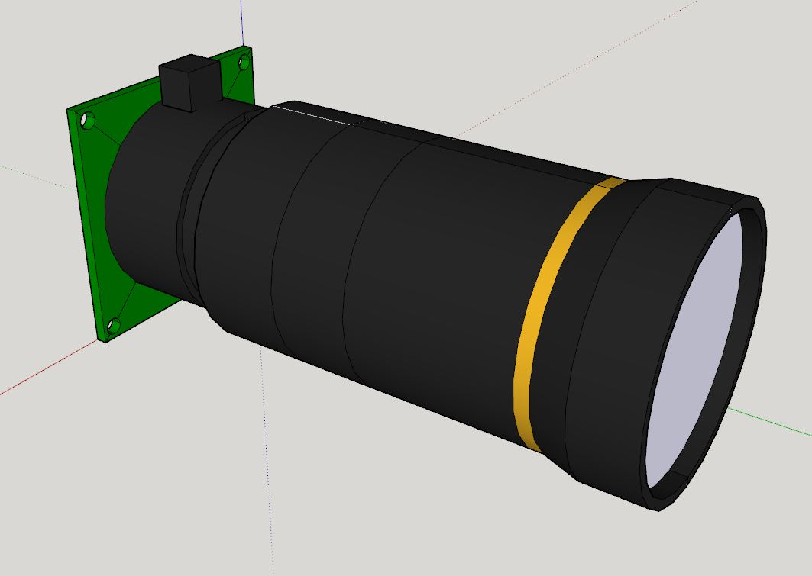
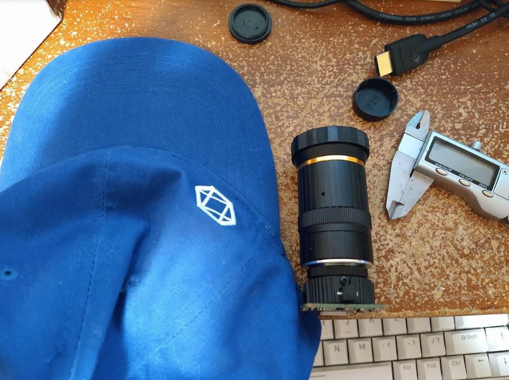
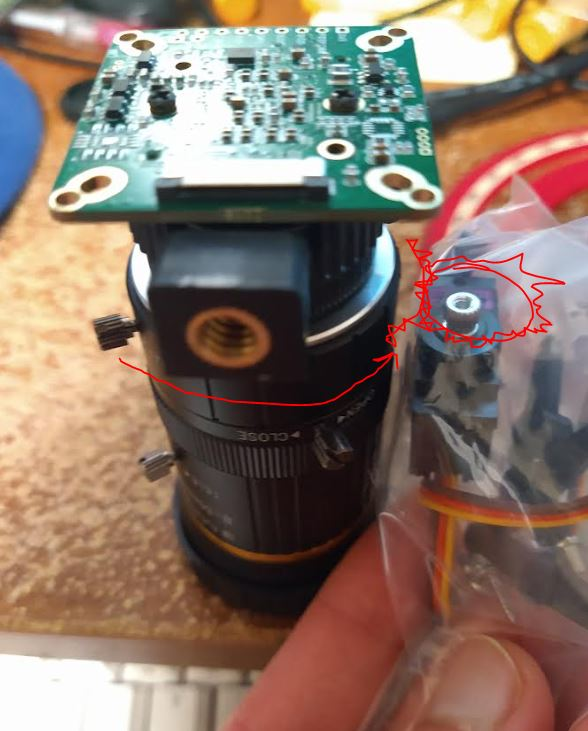
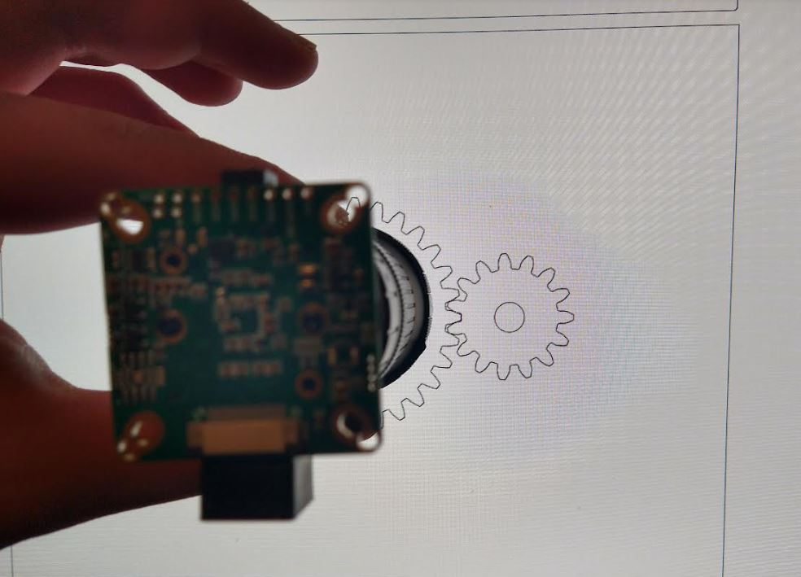
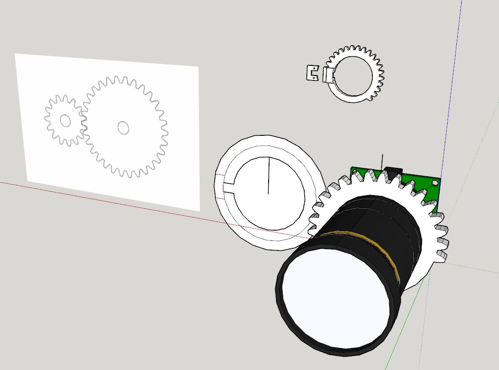

7:24 PM

tired today, will see if I can prototype and print the first gear that rotates the moving part(s) of the lens.

7:34 PM

the front of the lens flares out so they have to come in from the back, and then the other piece with screws sandwiches the silver knob.

There are grooves along the edges of the lens barrel so you can design with that in mind so the gear thing slides over that.

What sucks is the lense quality is not great, there's a point where it rubs inside.

So having some extra mechanical advantage on the already strong servos might not be a bad thing (small servo pinion gear).

7:46 PM

I designed most of this yesterday, just getting a model to work with for sizing

This is the slowest part of these projects the design, because the 3D printing takes even longer... and you gotta get it right or do it again...

What's hard is I still don't have a design... so I think I'll just go for it and build something random then figure it out later what's a more ideal design.

There's way harder stuff to do than this like the autofocus/ml part.

Ahh man I just had a thought... is there any reason for it to have an accelerometer... because it could have one, but why...

I am right-handed, there's no reason for the camera to be on the right side but that's where I'm thinking... so the servos will be on the right, and then the mounting hardware will be on the left... to hook onto whatever I come up with that clips onto the brim of the hat.

So the focus ring on the right side it goes like just past 45 deg to the right.

Then it goes... oh I have a protractor

like 65 deg

so

focus ring
- 45+
- 65-

tele
- 44+
- 60

These are rough dimensions... it doesn't really matter where they are, what matters is me not printing the whole 360 degree worth of gear

8:00 PM

Come on Jacob be the gear... what would the gear do

On the left side is max throw for the focus ring.

The middle knob doesn't move, just set to open.

The main mounting point I'm going to use is the PCB of the camera... once that is anchored to a plastic base, you have a nice thing to work with.

A 90-degree "fixture" to which other things are mounted to.

The lense will just rest on top of a base but I will add a front-flanged thing to slide onto/towards the front of the lense (gold ring area) and that will hold the lens down, give some compression with the gears... although the gears are to the right not vertical.

8:13 PM

it is too late to print today but I can make good progress on the gear designs

I'm thinking the hat will probably need to be drilled into... for a bolt.

The slip-on sliver mount approach is probably not good enough... imagine you look down and the entire thing slips off... broken.

I have not 3D printed threads before.

I like using screws like M3

Could probably do some kind of crimp pin approach, a split pin and you slide it through, use a screw to squeeze it together.

8:24 PM

ugh... this lens is oily gross to touch

I still feel like crap so that'll be it today, but got some more ideas going, once the main dimensions are down I'll start to speed up in build progress.

I mostly want a unit to work with (attached servos) so I can start programming the autozoom.

It'll be a challenge to make sure I execute frame analysis under 1/30 of a second or 1/60 of a second

https://evolventdesign.com/pages/spur-gear-generator

So far it's a 1:2 setup

6:43 PM so this gear is really bad, I hand traced it with SketchUp and due to it's size in inches, was complaining about arcs... yeah

This is going to be a really crappy gear

7:02 PM

I think I will try and print

7:08 PM

45 min print not terrible, got to design the pinion gear now, well trace
