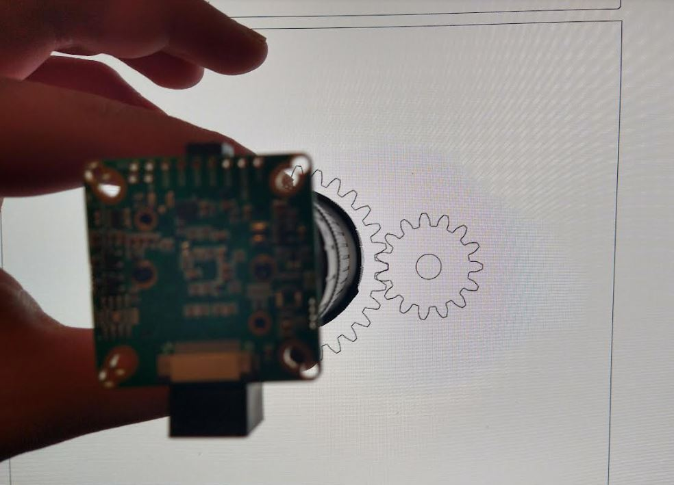
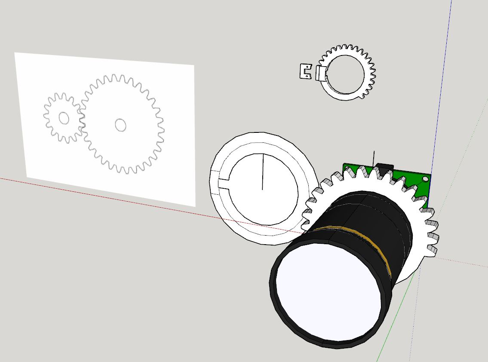
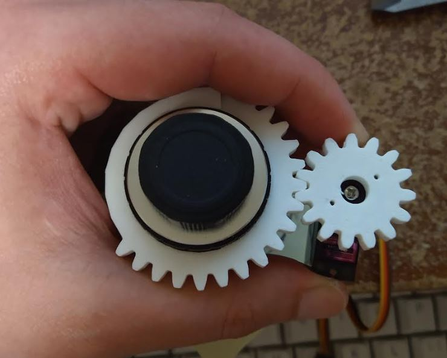

6:16 PM

back on... feeling better today regarding left over energy after work

been eating a lot too

I really want to 3D print something, but usually anything I print takes at least an hour, so gotta get it right otherwise just waste plastic

I'm going to take advantage of these grooves on the moving parts of the lenses as extra things for the gear to slip onto... so it stays straight.

6:34 PM

look at how dumb this is lol

I learned how to design like screw pitch and what not like 14-16 years ago but unused.

https://evolventdesign.com/pages/spur-gear-generator

So far it's a 1:2 setup

6:43 PM so this gear is really bad, I hand traced it with SketchUp and due to it's size in inches, was complaining about arcs... yeah

This is going to be a really crappy gear

7:02 PM

I think I will try and print

7:08 PM

45 min print not terrible, got to design the pinion gear now, well trace

7:22 PM

oh man this is so bad... literally traced and rotated one gear, imperfections all over the place, noob noob noob

you are subpar my boi

I want a physical prototype fast because I have major strides to make

Servo gear designed, need to print

7:43 PM

oh yeah first print, this is 20% infill

omg I'm stupid I printed out the notch, it's supposed to be a solid piece.

how's the fit though...

too tight to get around the lens

I can sand it down

this is amazing though... design and print... it's real

yeah I have to remove a lot of material, it's not slightly off it's off by a lot...

8:08 PM

I gotta remember this lens was not cheap and I can't brute monke force it in place.

font lens will need to have a slot that goes all the way through, two sandwiching outer plates

omg it's snug nice

had to sand a bit

8:30 PM

I hope I have enough servo throw

Oh damn the half gear means twice to rotate right...

might be bad

the tele does not move far

it's like 110 deg total throw... as in 220deg for servo hmm

8:57 PM

got a testing jig setup, gonna setup pigpiod

I don't have the lens base printed yet nor the servo mounts so this won't be hands free yet.

I'm actually pretty concerned about the servos not being able to rotate enough due to the gear reduction but they are 360 deg servos...

the feedback mechanism is the camera focus

I'm kind of excited about designing the case around the pi because it will have buttons and the OLED display

so get to design a UI menu too

9:15 PM

Oh no Mr. Harris...

yeah it doesn't rotate enough damn... 180 is all it does

I guess I should see if I can get away with it... otherwise... I'll have to print a giant gear for the focus ring lol... or use a stepper

I have a stepper... not a huge deal they're just big

9:22 PM

omg lens/sensor smudge reeeeee

ahh man... yeah I'm going to need a stepper for the focus ring damn

it's alright... don't cry Jacob

the sensor smudge is annoying me though, not sure how it happened

9:33 PM

the streaming peformance is bad, it's laggy

omg I got the smudge off, great

this thing is gonna be super chonk... with a stepper on it

I need the full rotation of the focus ring, the pinion on the stepper can slip off, will use super glue... but it's a concern like if you're at the field and it comes off

Tele rotates like 95 degrees so the servo is enough

ehh... it's more like 100... I should just do double steppers... dang

I'm sad, it's freaking chonk now for sure

the positive thing about the steppers despite these ones being cheap/sloppy is more accurate positioning

so I'll have to print new pinion gears with the slot design...

I've used these steppers in the past so I just gotta pull that code

