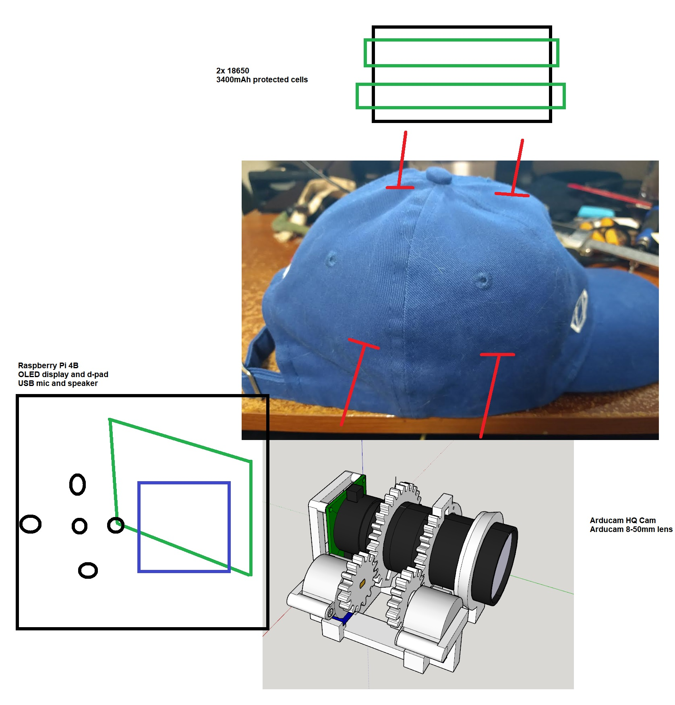

6:03 PM

back on had to do some stuff yesterday, PT too

I'm going to design the stepper mount/lens support

not expecting to print today but might

6:36 PM

making good progress, starting to have a physical structure

also had a thought today about having two pegs (per side) as mounts on the hat vs. wrapping around the brim.

it would be like an internal rivet facing outwards

6:50 PM

omg... there's a 3-7 second lag most times after I rotate/do something in SketchUp

6:59 PM

ugh it's so ugly

but easy to print and make

7:11 PM

I think I want to speed up the development of the lens part so I can work on the zoom programming vs. doing the complete assembly with the pi case and battery holders

idk... I know the software will take me a while, I have not trained a model before to watch for a specific object

7:37 PM

it might be wasteful (possible reprint) but I may just print this straight up with supports

I'll check the slice to make sure it's really solid

7:49 PM

damn 7 hour print, not happening today

I can start modeling other parts so I can design the body around them

Also test out button interface, try OLED display programming

8:00 PM

this is a rough layout of how it'll be setup

the hat will get two holes per side drilled out of it.

you'll have these rivet-like pegs that go outwards, flange on the inside

then the pi/oled/5-buttons is a box that gets attached to the main-chasis (lens/right).

on the other side of the hat is a parallel pack of 18650's protected cells

unfortunately each stepper has a driver board so those will be with the rpi

I was thinking about putting an ADC in here so the Rpi can tell the battery voltage... not sure if it's worth the effort, have to solder it in/more planning

I may just put a "on screen did it charge?" question when you first turn the thing on, hit yes/no and it will reset the internal uptime clock which is just written to a file

so you would have an estimate run time and then gauge battery life from that, not great but would work

also I was thinking about it, I probably already mentioned, I can use bluetooth at the field to access the files for playback on my phone
