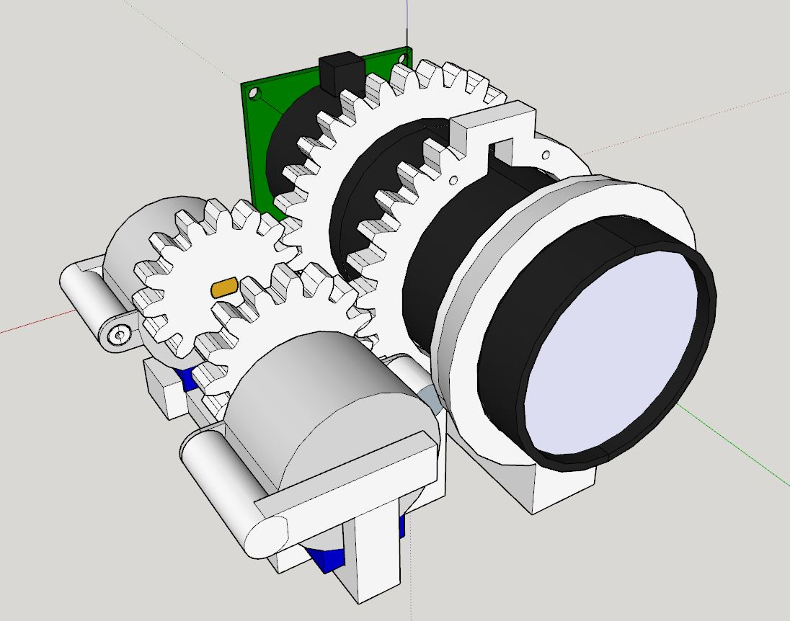
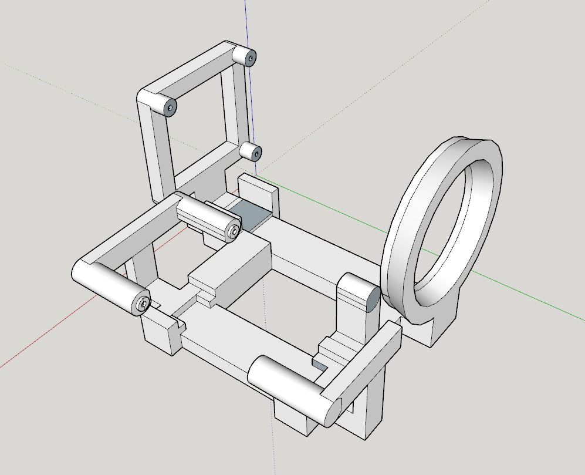

6:03 PM

back on had to do some stuff yesterday, PT too

I'm going to design the stepper mount/lens support

not expecting to print today but might

6:36 PM

making good progress, starting to have a physical structure

also had a thought today about having two pegs (per side) as mounts on the hat vs. wrapping around the brim.

it would be like an internal rivet facing outwards

6:50 PM

omg... there's a 3-7 second lag most times after I rotate/do something in SketchUp

6:59 PM

ugh it's so ugly

but easy to print and make

7:11 PM

I think I want to speed up the development of the lens part so I can work on the zoom programming vs. doing the complete assembly with the pi case and battery holders

idk... I know the software will take me a while, I have not trained a model before to watch for a specific object

7:37 PM

it might be wasteful (possible reprint) but I may just print this straight up with supports

I'll check the slice to make sure it's really solid

7:49 PM

damn 7 hour print, not happening today
