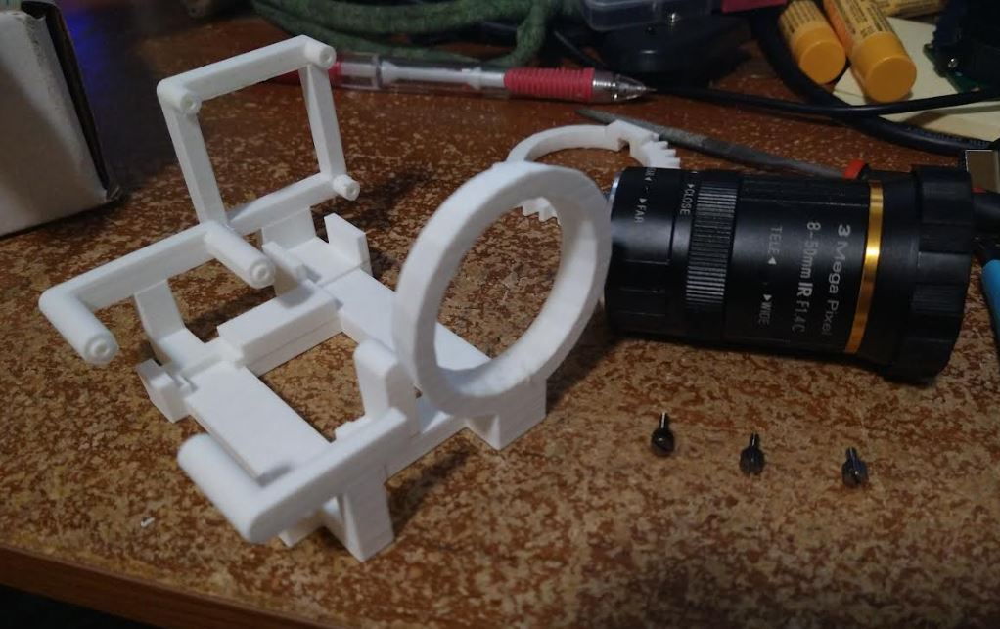

8:53 PM

I printed the chasis, surprise surprise it's too tight, gotta sand

9:08 PM

damn... I have to sand down a lot... because the open/close ring rises up like 1/32" of an inch compared to the rest of the barrel

9:27 PM

ugh... another screw up the telephoto ring also can't get over that open/close ring

10:30 PM

ehh... I gotta use hot glue

I did not consider the rotating knob grabbers (part of gear) hitting the supports

and the sanding made the tele ring unstable

these screws are garbage, I keep stripping them

10:53 PM

ugh... I feel sad it's poorly built

I'm going to program a basic zoom close/far thing for a demo video
