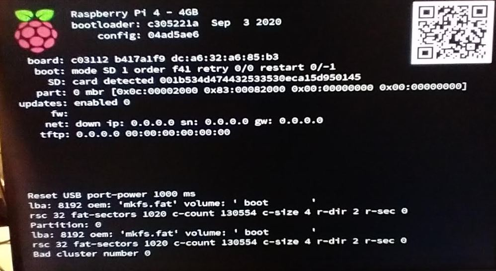
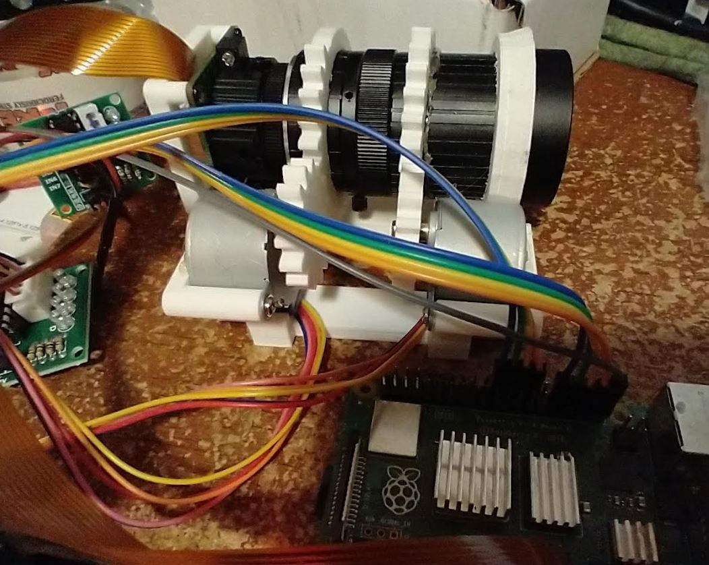

8:53 PM

I printed the chasis, surprise surprise it's too tight, gotta sand

9:08 PM

damn... I have to sand down a lot... because the open/close ring rises up like 1/32" of an inch compared to the rest of the barrel

9:27 PM

ugh... another screw up the telephoto ring also can't get over that open/close ring

10:30 PM

ehh... I gotta use hot glue

I did not consider the rotating knob grabbers (part of gear) hitting the supports

and the sanding made the tele ring unstable

these screws are garbage, I keep stripping them

10:53 PM

ugh... I feel sad it's poorly built

I'm going to program a basic zoom close/far thing for a demo video

11:03 PM

this two-stepper code I'm writing is not elegant at all just temporary

11:07 PM

... nope I can't do that

I need a class-based thing

I can run them separately at least

11:32 PM

the camera won't arm oof... think it's the ribbon cable which unfortunately is not easy to get to

11:35 PM

hmm... I might have killed this Pi 4 somehow, ith as a solid green light

maybe the camera shorted? I didn't have it plugged in while positioning the ribbon cable

might be the sd card

Well this is not a high quality sd card... I plan on recording to usb

I may even boot from usb but not sure, I considered using an NVME drive

Dang sacrificing my mobian sd card

No I won't, I'll use this other one, san disk but grey white

Is 32GB enough storage though...

Hmm I'll just do it now, I'll setup the 128GB ultra fit I have

Well I guess I can try to make this class-based stepper code now while I wait for that OS to write

I have a blister on my finger from the sanding ha and I did cut myself but not enough to bleed much

it's booting thank goodness... I have a pi zero 1 lying around but wanted to not kill this pi 4

damn I gotta re-install everything

12:08 AM

the usb drive write is failing... it's odd

let me try another usb drive

ugh... it keeps failing... okay I'll use the small sd card and usb drive for video storage

camera still works nice

12:32 AM

this is cool, I can watch the live video feed as the steppers adjust the lens

the steppers are not strong enough to hurt themselves I don't think... but I want to avoid that

I'll have to pick this up tomorrow but good progress

