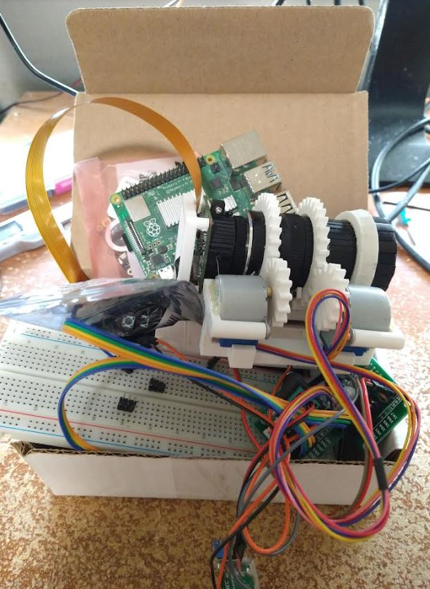
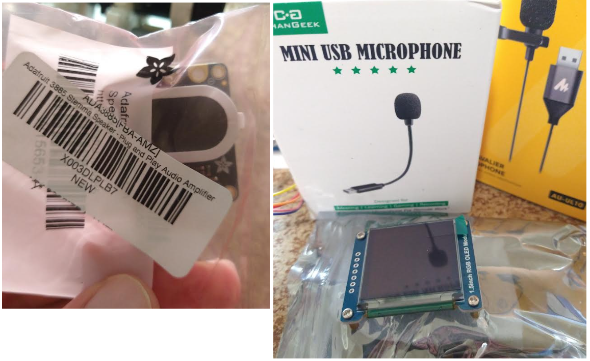
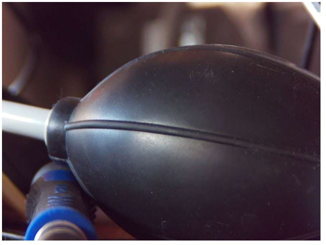
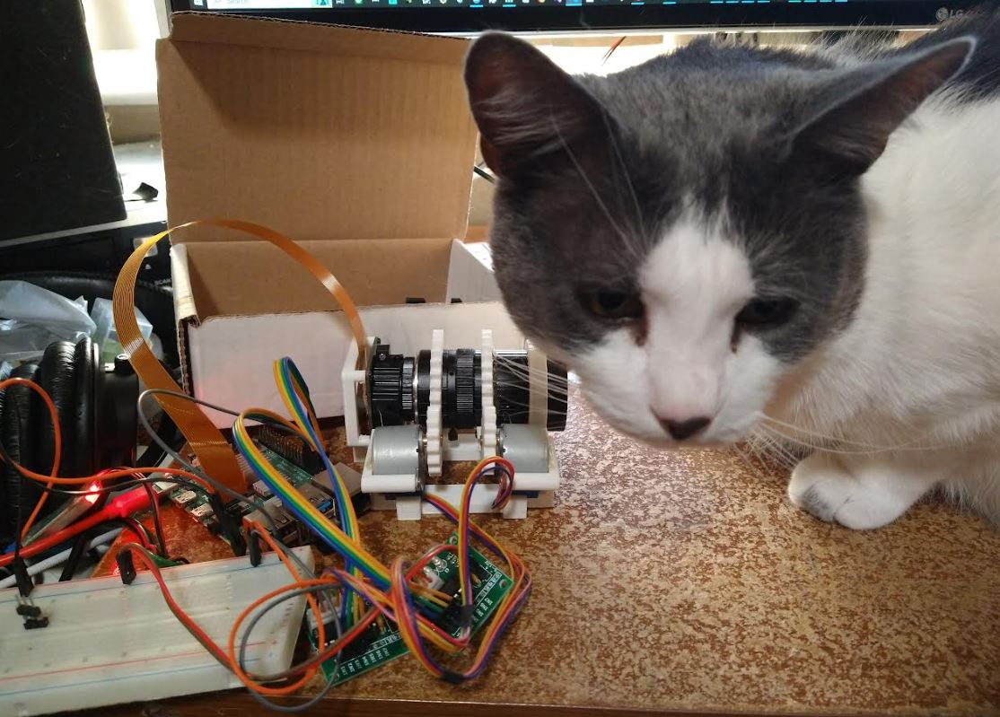
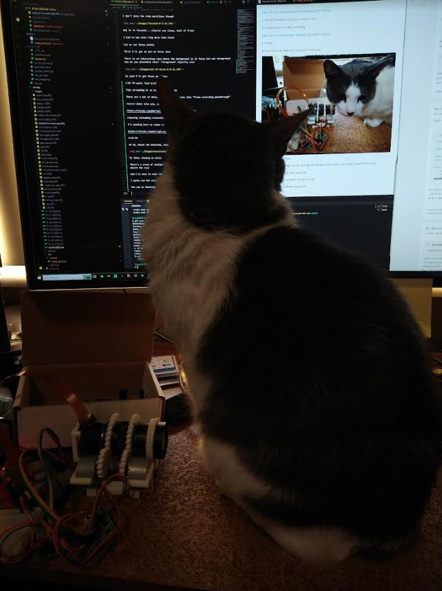
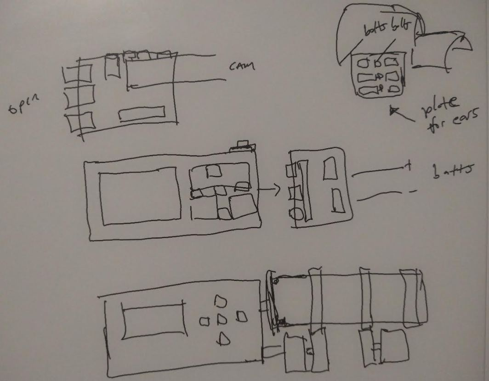

Damn I let myself sleep in too much on the weekend, I was ready as I am on 9 AM weekdays by 3 PM today lol

- fix the max positions being ignored
- integrate db, use main top level file

last time I worked on this I was trying to store every step of the stepper into sqlite so I don't lose position

but it's pretty nuts since it's storing a step like every 10ms.

so my idea now is to just store the final position assuming it all went through otherwise throw an error flag somewhere that makes the user have to reset it visually

I should have designed in bumpers but I did not think about it at the time

Got my coffee... cherry reds keyboard, 91% isopropyl alcohol to clean it with dove soap for my hands to be grippy and not oily

I'm unfortunately sweating though from the caffeine

I bought the nylon bolts yesterday to mount this system to the hat, has wing nuts, will secure it like loctite with electrical tape

I also got more gold sandisk cards 128GB so I'll start fresh with that

I would like to get the procedural (what?) zooming done where it's analyzing pixels and zooming based on how a human would do it

This is not ML, the ML part of this project is after it's focused, where it detects the plane and then works on keeping it in focus/the right size

3:55 PM

OMG Jacob start!

I'm fk'n scrolling through social media, free yourself boi

4:00 PM

eventually this box of parts will be a fully assembled unit, two parts (electronics/lens and battery on other side connected by power leads)

here are the other parts for the menu interface and voice in/audio out

Ideally I'd use a multiplixer or something to not use pins for 5 buttons but ehh... I have the pins (I think)

Time to power it up

The new SD card does add delay since it's a blank install

4:37 PM

alright almost back to where I was before

I need to re-center it, have the DB store the final positions, add a flag for manual reset

then I need to start extracting frames from video and working on it/seeing how fast I can iterate over pixels and do computations

finally I work on something that needs performant code

executing within 30ms that's not terrible

damn... this will be hard... I know looking at a picture that it's blurry but what makes it blurry... it's the softness, lack of contours

4:48 PM

The Pi 4B does get hot while streaming 720p video

Starts to lag too, let me get a temp check, I don't have a fan, might need one

Not sure how performance intensive video recording is

57C is current temp according to inxi

Oh 80C is where it's too hot, okay have room

4:52 PM

I'm doing manual control, I see that it's blurry, I will try rotating in a direction as a test

I don't know if I'm zoomed all the way out or not though so I'll divide the 8-50mm range with steps and then focus ring as well

4:56 PM

so here is a focused version 8.5" away

I don't know the step positions though

Why is it focused... clearly see lines, most of frame

I had to use tele ring more than focus

Let me set those points

First I'll get an out of focus shot

There is an interesting case where the background is in focus but not foreground how do you determine that? "Foreground" majority size

So yeah I'll get those positions

5:01 PM quick food break

This streaming is so laggy not sure why

There are a lot of things I want to look into like "frame recording passthrough"

record video into usb, see the playback

https://forums.raspberrypi.com/viewtopic.php?t=126722

reducing streaming resolution is better (obv)

I'm looking here on video recording

https://forums.raspberrypi.com/viewtopic.php?t=126722

5:16 PM

uh oh, house rat detected, electronics worst fear

He likes chewing on wires

There's a crack of sunlight coming through the window in the back so he wants to absorb the rays

hmm I'll have to look into this more later

I gotta set the stepper positions and db for now

the cat is blocking my screen now great

5:36 PM

ugh... distracted let's go

metal focus playlist on

5:41 PM

ugh this SSH back and forward sucks

5:45 PM

I was sketching out how the electronics box would be laid out at one point

I was intending to let the steppers hang/be at the bottom so the video would have to be rotated 90 deg at some point

If that is a processing concern then I'll have keep it sideways

It makes more sense for natural stability.

It's also more ergonomic, you could print a rounded case cover over the stepper section.

In the middle the boxes under the buttons are the stepper and other boards

Also I was thinking you would print some kind of plate to cover your ears so this thing doesn't jab into them

5:57 PM

the max check is not working

oh yeah... probably because it's not persisted

6:06 PM

ugh... this is where there's so much going on I'm starting to lose track of what I'm trying to do

6:39 PM

Ideally what happens is I can move the steppers to some random position, get their position, focus and focal length

restart the pi and have it pick up where it left off, hit zero and it will zero the steppers based on current position

I'm looking forward to getting to the stage where you have the main looper that's waiting for user interface input to do something

then being able to use bluetooth and pull the files off in the field to view on your phone that would be sick

it would also be sick to fix my broken airplane and not be poor, be free not live under constant dread

Got my headphones on let's go, sh* out some work

the time is now, nothing else on the mind, chase that delusion

7:07 PM

Okay now to try and get it to rotate beyond position

failed... good thing this stepper is weak/can't destroy itself and going slow

I want to see how fast it can go actually

okay that's bad... fastest it can go is 0.001 tried faster eg. 0.0001 and it briefly lit up/didn't move, guess that's too fast/doesn't wait enough

says max speed is 10-15rpm at 5V

damn... this could be a fatal flaw with this project (not able to keep up with moving item due to slow zoom)

but it's also like training wheels for me a noob who needs to work slowly before it is ready to go fast

I gotta figure out this RPM thing, how to turn that into zoom speed

It doesn't have to rotate 360 deg so that helps

I need to run the stepper and watch it at my current speed

Something like 4.69 seconds, 4.50 ish... I know mathematically I should know

requested 512 at 0.001 delay

0.512 seconds...

interesting that it's faster

yeah even though I push late when it's done it's still in the 4.67 range

so it's around 13.3 RPM (60/4.5)

damn I gotta rezero these again

7:41 PM

ugh... this is not working... the manual zeroing should technically be stopped by max limiter though you want it to ignore since don't know the bounds

8:16 PM

ugh... this sh* is f'd

Zeroing needs to ignore db stuff... will need a separate copy for manual calls

ugh... it's so much code to move though hmm

I think I'm spent already damn... only 5 hours

zeroing in the end writes 0 to db that's why I shouldn't update the current step(s) in normal use

