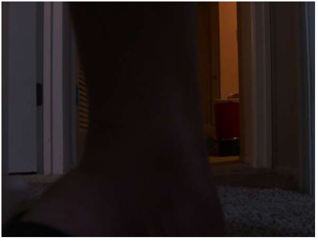

6:58 PM

a little earlier today, was feeling tired briefly sip of that good good (NOS)

I'm switching to something new now, going to start analyzing frames to determine which way to go for focusing

One thing I want to know is the zooming relationship

I will need to do some testing with known distances

| Focus (steps) | Zoom (steps) | In Focus | Distance (in) |
| ------------- | ------------ | -------- | ------------- |
| 0             | 8            | no       | 0             |
| 310           | 8            | yes      | 5"            |
| 330 (max)     | 8            | yes      | 16"+          |
| 0             | 300 (max)    | yes      | 45"           |
| 80            | 300          | yes      | 99"           |

So at 0, 0 (focus, zoom) (near, 8mm)

Can't focus on anything

7:16 PM

damn... I need to test max distance zoom... indoors?

35" + 24'

7:37 PM

conjuntion of forward (up key) and left

7:40 PM

Oooh I just had an idea, I can size my plane and judge zoom depth

using this method

8:04 PM

mini panic attack couldn't find the bolts for my plane's wings

I miss this plane, been sitting in the corner

So at full zoom, the plane is not able to fit in the frame, that's good

although at least 50% of the wing is visible

so with no zoom you can see the plane in the frame you'd want, around a third

about 130 zoom is a decent framing, maybe even zoom out more

8:15 PM

I gotta cook food

The aperture is not wide open here hence it seems so dark

Particularly on super zoom but it's fine since it'll be a sunny day most days I fly

lol this scared me when I looked at the cut feed

