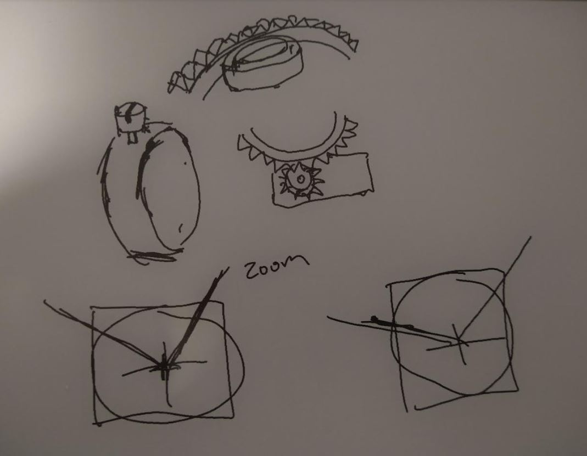
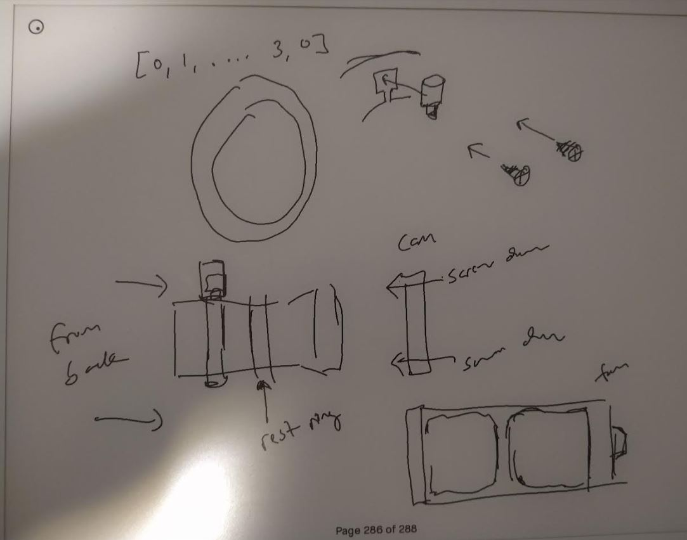
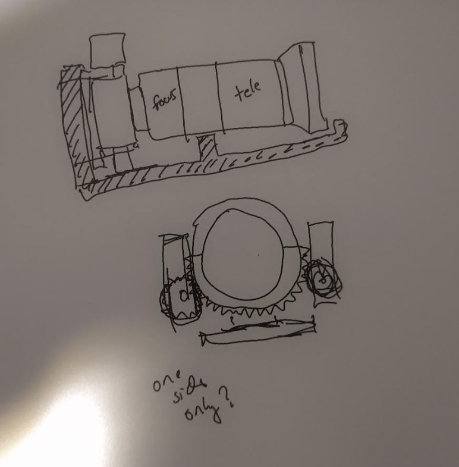

7:26 PM

I was side tracked today, did the bi-weekly shopping but also the trees were covered in snow today

I had this urge I couldn't let go to go out and take photos

Anyway I decided to just start working on this project

I'm in the design phase still, sizing things up

Some initial thoughts on how the servos will move the rotating parts for telephoto/focus

The plan is to print these gears that go around the lens and it has a slot for the silver bit that you grab to rotate. That'll get sandwiched by another layer with screws.

