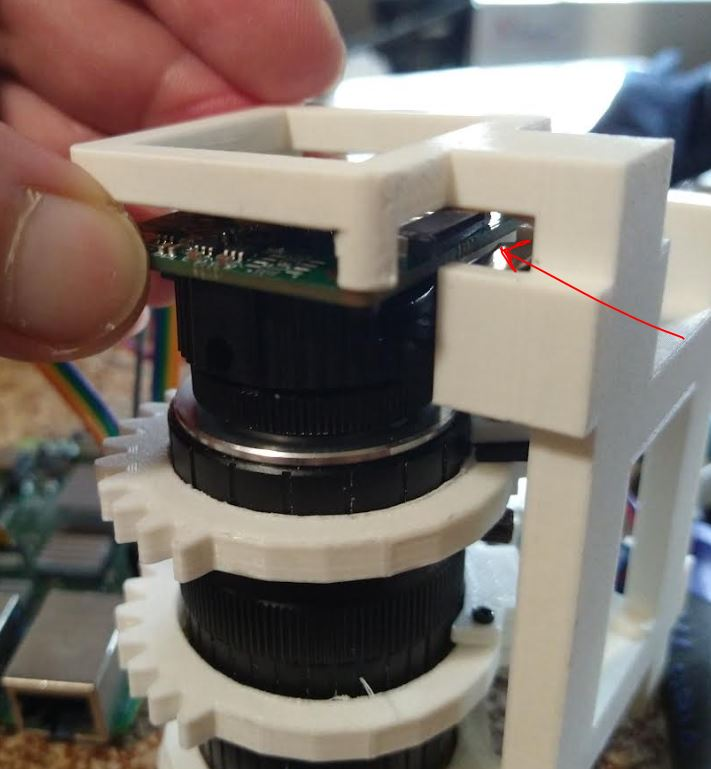
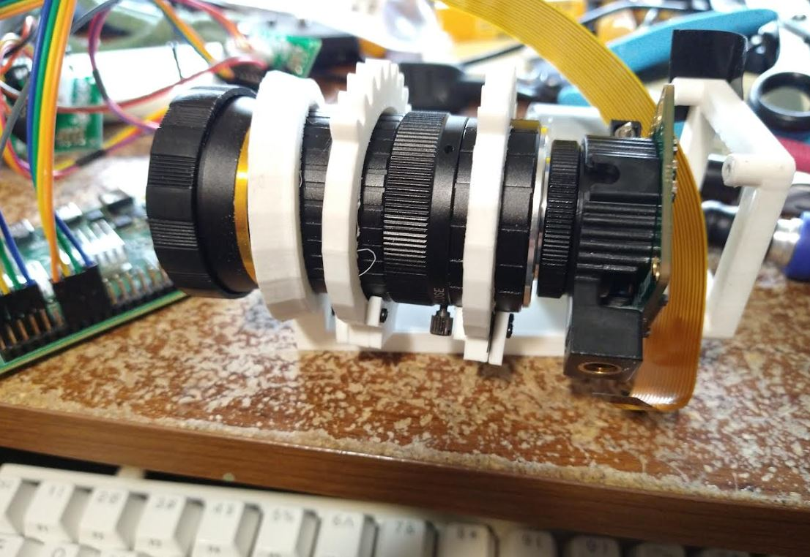

11:57 AM

alright alright, fresh new day just for me

12:06 PM

so first thing I'll work on is making the stepper stuff class based

eventually I will have to change the original code/make it faster

it's currently slow which is a good thing so I don't destroy it by moving too far (no physical tracking)

1:44 PM

weird issue where stepper won't change direction, working on zeroing

1:49 PM

I did realize I'll probably have to use threads for this to rotate both rings at the same time

oh I got it was a dumb copy/paste issue

2:07 PM

the camera doesn't always initialize that's a problem, I have to restart the pi

2:23 PM

yeap... there is a fatal flaw with this design, it's the ribbon cable being hard to access

the way this ribbon cable thing works too is annoying like you move one side up, the other side goes down

2:30 PM

I still can't get the camera to go back up ugh

2:44 PM

omg... REEEEEEEEEEEEEEEEEEEEEEEEEEEEEEE

I gotta disassemble it so I can keep plugging/unplugging the camera cable in

once it's set need to tape it down

it's not too bad... just unscrew and tilt to the side

3:23 PM

I can't get the camera to come back on

I will try another pi to see if it's the camera that's the problem

sucks... project is dead if I can't get this thing to work... I can buy another camera this time from RPi

3:38 PM

ugh... worst case I can reflash the SD card see if that 'does something'

still trying to get the Pi Zero up to speed

worst case I buy another camera... delays hmm

the pi zero is no the right computer to use for this too weak

3:48 PM

ugh this is such a motivation killer... like it just stops working and I'm f'd

I might drive to a store 30 mins away just to get another one of these cameras

omg f' it I'm just gonna go and buy it, I can't have this thing keep failing

4:01 PM

ugh... the adapter is a different design I may have to redesign the chasis if I can't swap it with the Arducam one

6:25 PM

omg back on...

luckily they had some HQ RPi cameras... I hope the adapter is the same or swappable.

I also finally got a pico w, had to make my drive out there worth it

these things are not cheap $50 each, I was tempted to buy more than one but I'm trying to not buy things unless I am actually using them eg. no duplicates... it's a risk but cash in hand you know

6:33 PM

oh man... the screw holes are not the same position and the mount is off... ahhh

the pi uses bolts too for the adapter mount not screws

I'm driven by obsession right now like I'm so mad

the bottom of the RPi cs adapter is detachable nice

or lens adapter not sure what to call it, mount

I might have to print a snap on camera pcb mount since the screws are in the wrong spot

I will see if I can swap the mounts

the screws still don't line up but if the bottom is supported that could get glued in place along with that clip thing

Arducam mount 0.78" apart

omg... it says "no cameras available still" wtf

maybe I have to wipe the SD card...

well... this is is not a good sign the RPi camera is also not working...

I have some old ones IR I'll test that. Well that's an old camera probably meant to work on raspistill... ugh... time to wipe

6:57

the adapter holes do not match RPi is 0.9 something apart

do I feel stupid driving and buying this thing? maybe... but having a "spare" is not bad

I would have bought another pi4 if it's the ribbon cable slot on Pi 4 that's the problem but they didn't have any

7:09 PM

okay wiped sd card rpi cam is working

let me try arducam

it could be the GPIO pins being plugged in, not sure

7:18 PM

Arducam is working again too but I unplugged the GPIO pins

I'm going to proceed with the Arducam because I designed the camera pcb mount around it

ugh.... I have to re-setup everything again... updates, git...

7:31 PM

I'm afraid to update my Pi in case it breaks again

7:57 PM

alright... I'm back to where I was before, now post food coma

ugh... I have lost some motivation but I need to produce a video

8:11 PM

I'm going to write a manual keyboard control real quick to film with

I gotta think about how to do the frame by frame analysis

check speed

8:23 PM

I'm afraid to turn this camera off lol

9:09 PM

lmao I turn it off... turn it back on... no cameras detected

fuhhhhhhhh

I gotta test my GPIO theory

yeah I unplug the ground and it starts working... let me try again

I mean... I could just add a physical stepper switch... it sucks, the alternative is to make some electronic switch... I don't really want to get into that

well... I feel silly now buying the pi cam but it goes in my parts box
