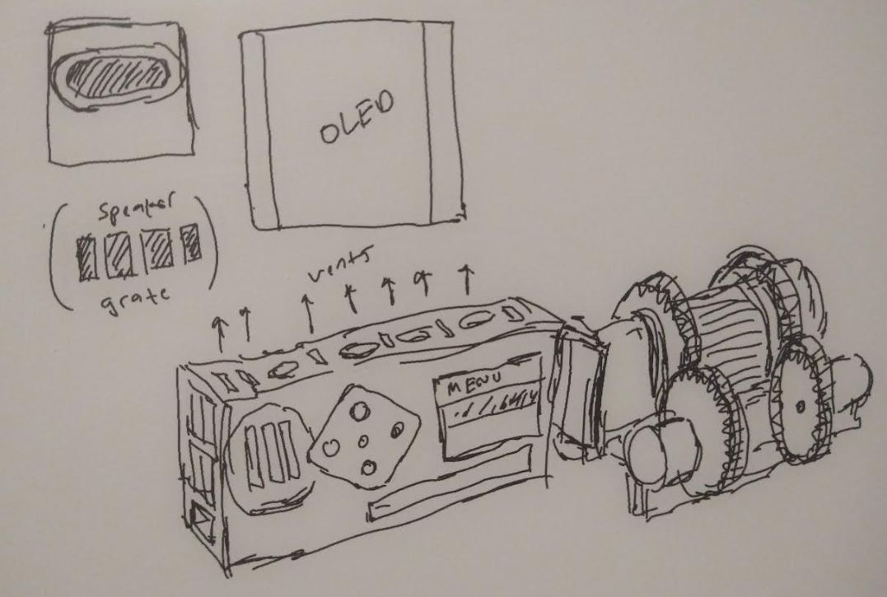

5:13 PM

working on the menu/display today, maybe buttons, I'm concerned about not having enough pins

there is also the concern of the speaker but I think I can use the stereo headphone jack output

damn this thing needs 5 pins... this OLED

5:26 PM

now that I type it out, there's actually plenty of pins left

5:30 PM

oh boy it uses SPI

I suck at SPI

I am tired today but I want to see this thing light up, then I can measure it, plan where it connects

3.3 V connection

https://www.waveshare.com/wiki/1.5inch_RGB_OLED_Module

damn... I gotta move a stepper, maybe not, on Pi 4 anyway

5:38 PM

takes a bit to plug in

6:08 PM

whoa this looks great

now I have to look at their example code and adapt it into my own local library to draw a menu

their example shows the OLED connecting to Pi's 3.3V but they say max-white draw is 70mA which exceeds what the pi can do so I'm using an LD33V for an external 3.3V power supply

I gotta solder up a 5-button D-pad.

~/OLED_Module_Code/OLED_Module_Code/RaspberryPi/python/example

it's pointless but I want to try this adafruit speaker

I would use pygame and pre-saved amazon polly sound bytes like from my HN news article reader project

I still have to put a voice trigger in here local model for voice command

Damn I'm tired

6:25 PM

a great sacrifice has been made, I cut this skull candy headphones for its audio jack

wow the pi 4 runs really warm/hot even while it's not doing anything hmm

I had this ultra fit usb drive in there though wonder if it's from that, those things do get hot

6:34 PM

I'm looking forward to this not being a collection of random parts and wires

Anyway that's it today I have a headache

6:56 PM

I'm still not 100% on the design but something like this

I hate to lock a Pi into a project... this thing is pretty much just a video camera

So I'm trying to avoid permanently attaching it/soldering... a 40-pin connector would be cleaner but it's also convenient to keep the remaining ones accessible

I'm contemplating on putting a fan on it... but that means more power draw... idk if it's needed since right now it does not approach thermal throttling temperatures...

I also did not buy a fan... I'm trying to stop buying things because I'm poor

It's possible I'll rotate the camera/lens set 90 degrees clockwise from the back, so the steppers are in line with gravity but means extra processing overhead

I also may put the d-pad on right side... as I'm right-handed

but left isn't so bad, I think as it's designed above it's easier to access since the gears and what not are on the right

