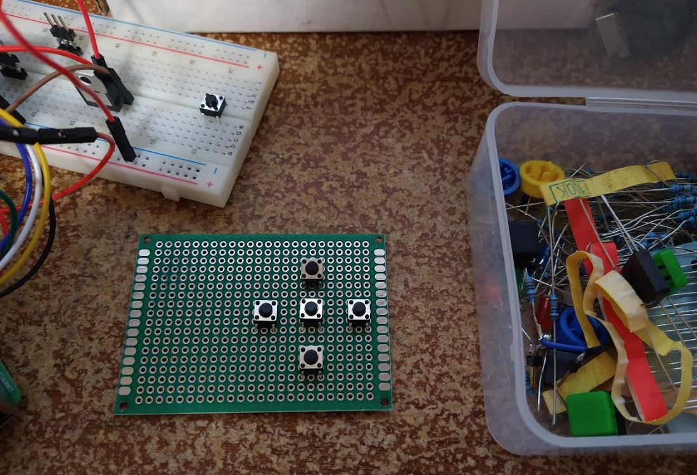
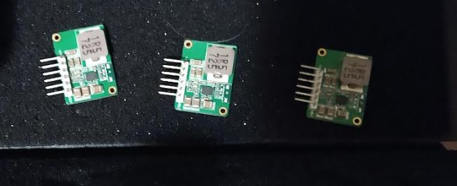
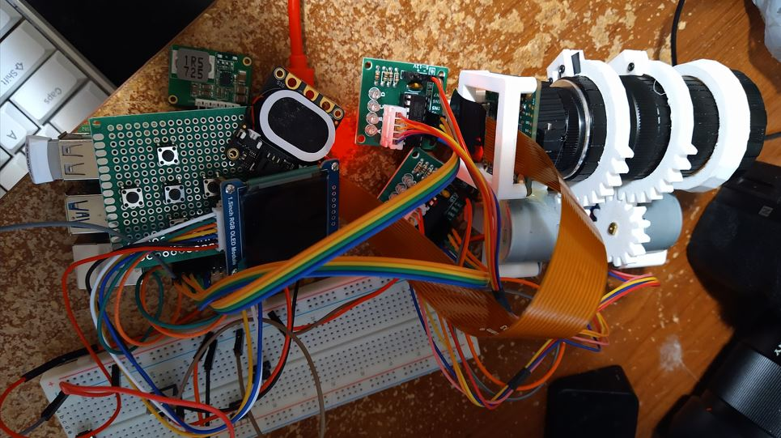
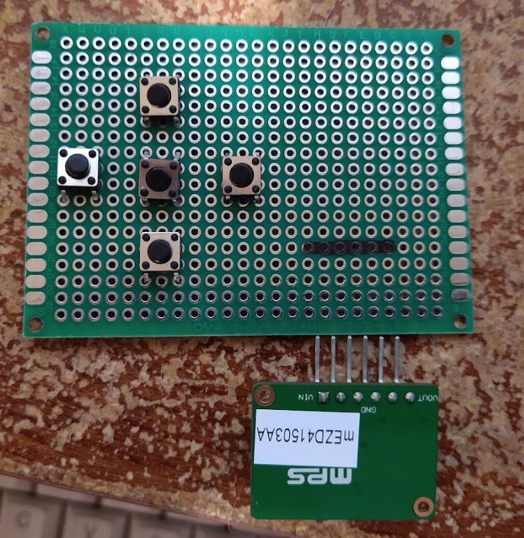
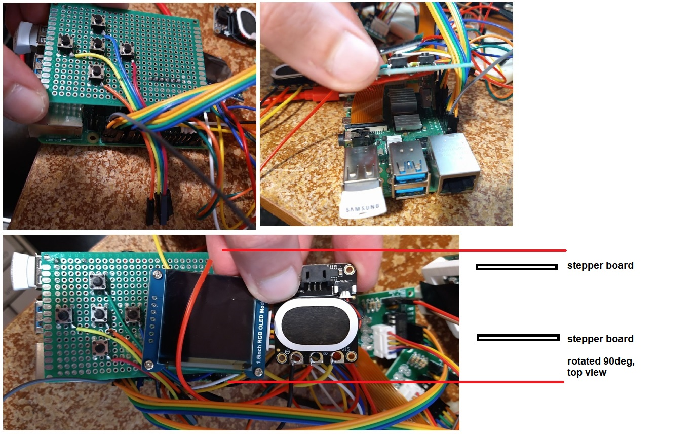
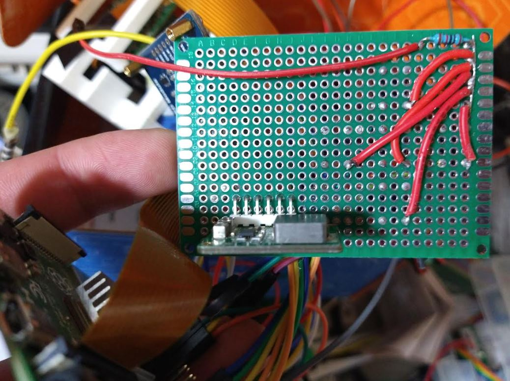

5:39 PM

blurry eyes, head on desk/arm briefly

I'm going to work on a physical button, because I want to plan that out I need 5 of them wired up and then I can design the body that houses everything

https://raspberrypihq.com/use-a-push-button-with-raspberry-pi-gpio/

I'll use 10K resistors

https://forums.raspberrypi.com/viewtopic.php?t=46525

I'll solder up a board today, random size

5:49 PM

yeah I'm getting tired of all these wires

I see... you connect it to 3.3V and put a resistor inline then to the detecting pin

6:02 PM

ehh... this is kind of a waste but having room is nice

That's the ideal separation to me

I think I'm going to build it like a sandwich... the Pi 4 gets screwed into the bottom case and then the d-pad gets screwed into the top... along with the stepper boards

dang... these parts are big... the device is going to be big

oh yeah the buttons won't all be on at once so I can just use one or two resistors

6:11 PM

ahh man... oh well, I'll make it work

6:15 PM

it's that "he went to Jared's?" ad but Mouser

these are expensive single cell to 5V 3A units... I think they're $14.33 each

The two protected cells will be in parallel going into this (but using 1 channel) then feed the Pi/steppers with this.

The display will use a 3.3V LR on its own.

6:23 PM

this is roughly how it will be laid out... it's not how I'd like but what I will arrive at. In particular I don't like where the speaker is.

It would make the body much longer to do the design from yesterday

the body will still extend beyond the Pi's length to accomodate the stepper boards, they will be at 90 degrees/orthogonal against the Pi board

and I'm going to have to solder the wires to be shorter so they take up less space

6:36 PM

I'm curious if I can extend this speaker wire... I would think so... it's past the amp

the speaker is not attached to the PCB so it can be placed whereever.

So I think I'm gonna keep this solderable prototype board whole

the mEZDA41503A-A will serve as a raiser block under the board

I will have to flip the OLED output since the wires take up a lot of room/easier to have them come out on one side

It will probably take me a couple of design prints to get this right sadly = long print times

it's the damn wires that take up the most room

6:42 PM

7:05 PM

4" lead length for tactile buttons

7:12 PM

wtf... that's completely wrong wth...

damn it... gotta resolder it again

omg... it's still too long holy shit how many times... 3rd time

7:46 PM

I'm going ahead and doing the speaker soldering too

8:04 PM

reeeeeeeeeeeeeeeeee

these wires are triggering me

yeah I did not finish the soldering jobs today, I still have to put in the LD33V in there

but I'm going to build this physical body... I don't think I can get it all done by end of this weekend but close

I did not get to these the buttons in python but I tested them via multimeter/continuity/resistance check

I wnat to hear the speaker too... check that I picked the right channel and don't need the ground pin on the jack (since rest of system shares ground)

this is unfortunate with the speaker on the right oh well

the stepper boards will face each other, wires inside

the left unit will be whole and then it will have an extension that the lens/camera assemlby slide into

the camera/lens and steppers is pretty heavy so that'll have to be robust

the whole thing will be held on by two nylon bolts to the hat with wing nuts

will put tape as temporary loc tite

8:17 PM

oh yeah this is what the bottom of the dpad looks like

The buttons all share the same 10K resistor arguable bad design but all buttons won't be pressed at the same time (shouldn't)

then the bottom board thing is the 3.7V to 5V 3A step up power supply

somewhere I have to put the LD33V it may be laying down due to space, right next to this step up power supply is the cpu radiator fins
