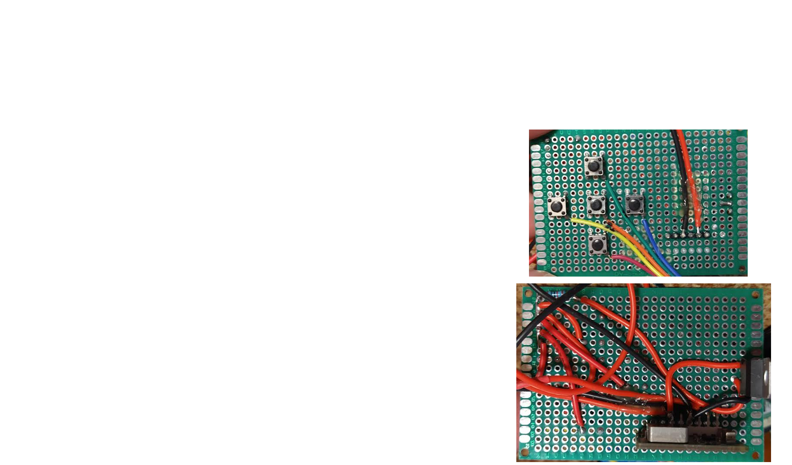

6:40 PM

going to work on more soldering stuff... I have to find a place to put the LD33V and then connect the speaker to a 5V power supply (output of step up converter)

7:31 PM

I soldered the speaker to the 5V out, soldered 3.3V to the battery which feeds step-up... I figure waste to step up then down

I still have not fully assemlbed it/need more soldering in the future (mostly shortening wires)

I need to start designing and printing the shells so I can mount these things and clean up wires...

I need to make a wiring diagram while this is fresh in my mind... this is not pretty/probably would not be reproduced

It's a niche uses case too... most people don't want to strap a VHS camera to their head

7:58 PM

ehh... I feel spent today

I have to finish diagraming this out at some point

