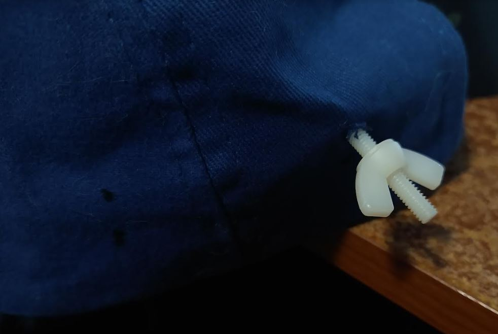
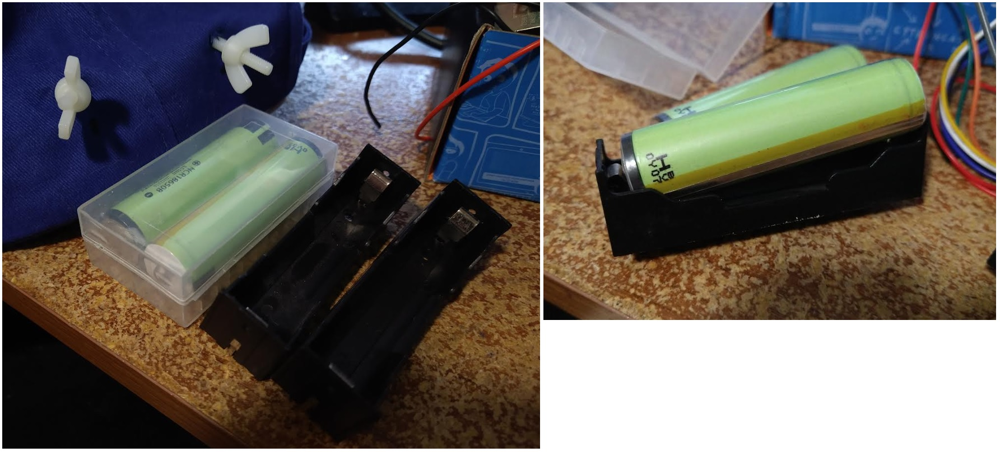
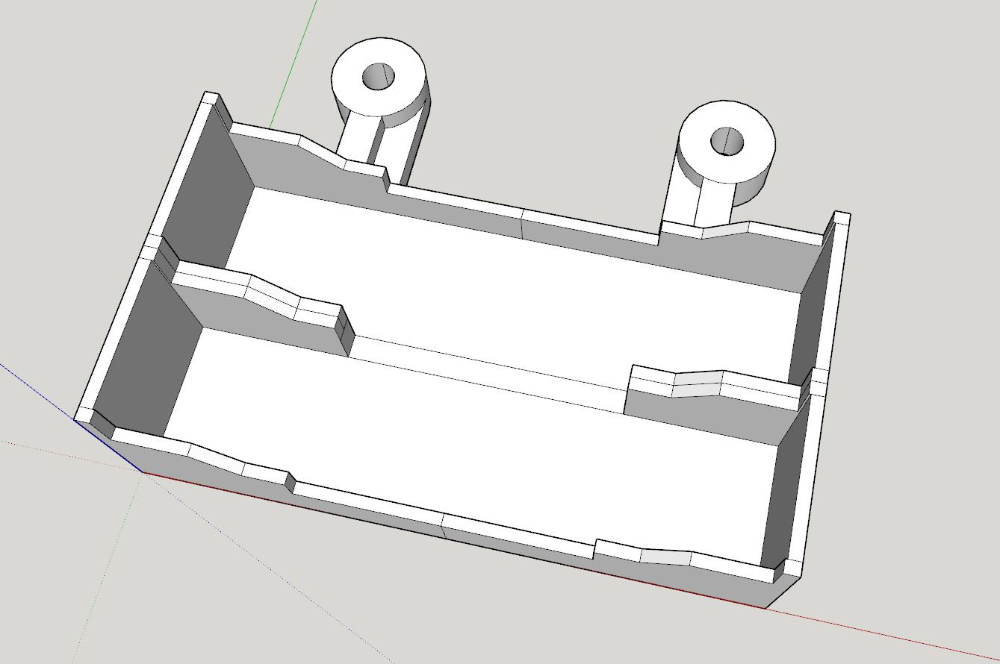
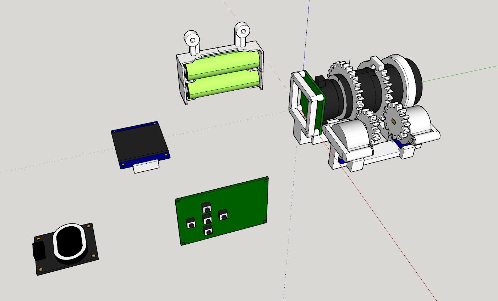
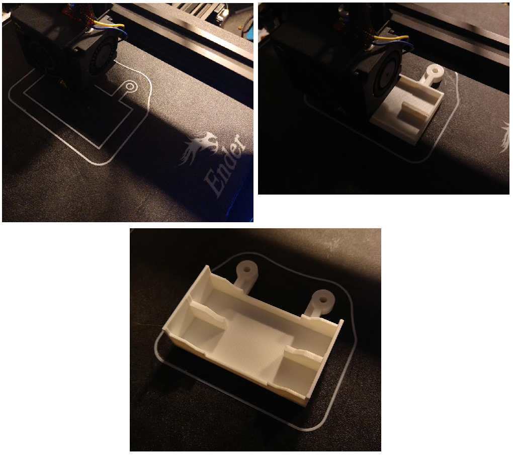
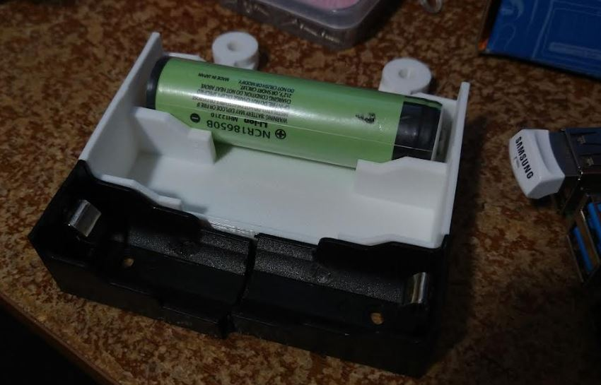

5:07 PM

going to focus on getting this physical bit designed/printed as by end of Feb/early Mar I have a new toy to mess around with (this one I am not building). Will get lost into that for a bit, make content but this project will otherwise be my main project for spring/summer use.

I want to start recording videos with it and gather data to train the ML model on.

Modeling list

- Pi 4B
- OLED
- dpad board and power sources
- battery set

I'm thinking about prioritizing the battery pack actually since it's pretty easy (copy Twerk Lidar Robot battery case)

I could also start working on the bolt design

Ha here it is, first one, I just picked an area that seemed to make sense/thin material

Used my DMM probe to make the hole/widen it and then just thread the bolt through, don't feel it from inside the hat.

It is a 8-32x1 Nylon Mach Screws with Wing nuts matching size

5:26 PM

I do not feel good right now, tired and feeling lazy but I'm going to keep going

I'm glad I'm finally using these... the TLR uses one and it has not ran in a while.

You can see how the cell is too long for these flat cell cases, I have to saw them in half (where is that saw) and then super glue them into the 3D printed case that has the bolt hole mounts.

5:37 PM

I'm kind of skipping corners here, not an ideal design

Specifically to prevent the battery from falling out.

They're held by the springs... I can also print a clip thing that covers over them/holds them in place more... that would suck you come back home and a battery is missing/fell out.

I'll see how bad it is, worst case use tape or a wire you twist (bread tie)

5:46 PM

this looks good

The sawed-in-half parts (black with springs) go insdie those holders with glue

then you solder those power leads with a switch in between to the rpi board

Maybe I can print this today let me see how long

2 hrs this can be done today nice

5:54 PM

sawed the battery packs in half... will continue modeling parts while I wait for the print

then I'll solder/assemble the pack with the switch on it.

5:58 PM

first round print thing was not good moving... I had to rezero the print head

6:04 PM

set it too low... reset

going to model the OLED

6:54 PM

tested the wiring of the dpad/psus and speaker, it's all working, the speaker needs shared ground with the incoming audio... so hopefully since the pi shares ground with the board it should all work

oh I also wired the d-pad buttons to be powered from the LD33V and that's good for the pin sensitivity on GPIO in

7:54 PM

just modeled the dpad protoboard

I'm gonna have to pick up tomorrow I think on this... the battery case assembly, model Pi 4b but made good progress

print is almost done I have pics

what I have to design is the body that everything mounts to... I'll check a lot to make sure the screw dimensions/internal spacing is right, then print... I imagine each half will take like 7hrs maybe more... so that's why it is not great to get it wrong

8:13 PM

just finished nice

omg... I just made a mistake

I printed the black battery holders... not the plastic that goes around it... damn

I'm gonna have to rework that and reprint... ugh.... damn

Ahh... it's alright... it's alright... no cry Jacob

I should have known looking at the model... there would be an inner and outer layer

Ahhhhhhhhhhh reeeeeeeeeeeeeeeeee

it's okay

8:41 PM

I just had a V2 thought... the hat should have an IMU so it can tell if the head is moving fast, and then in that case you'd sample faster for autofocusing vs. sitting still/assume less image change
