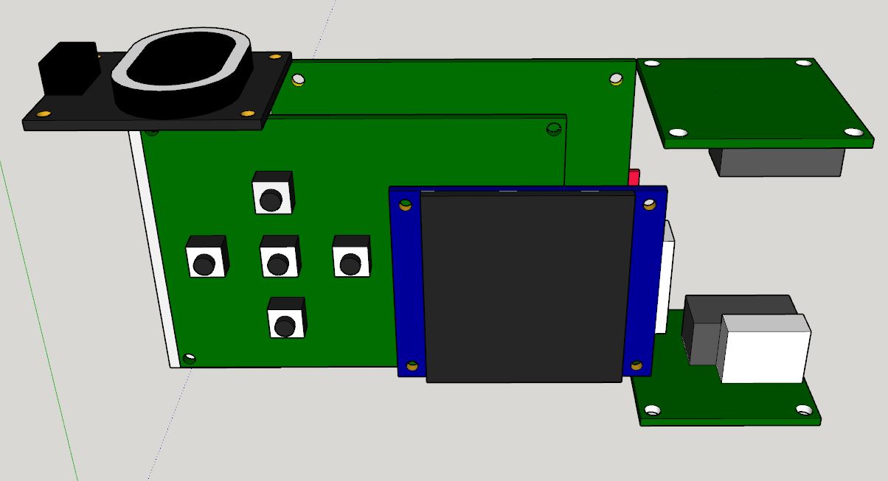
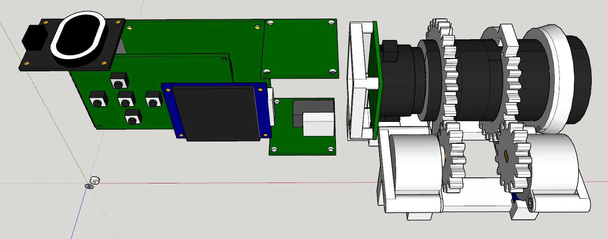
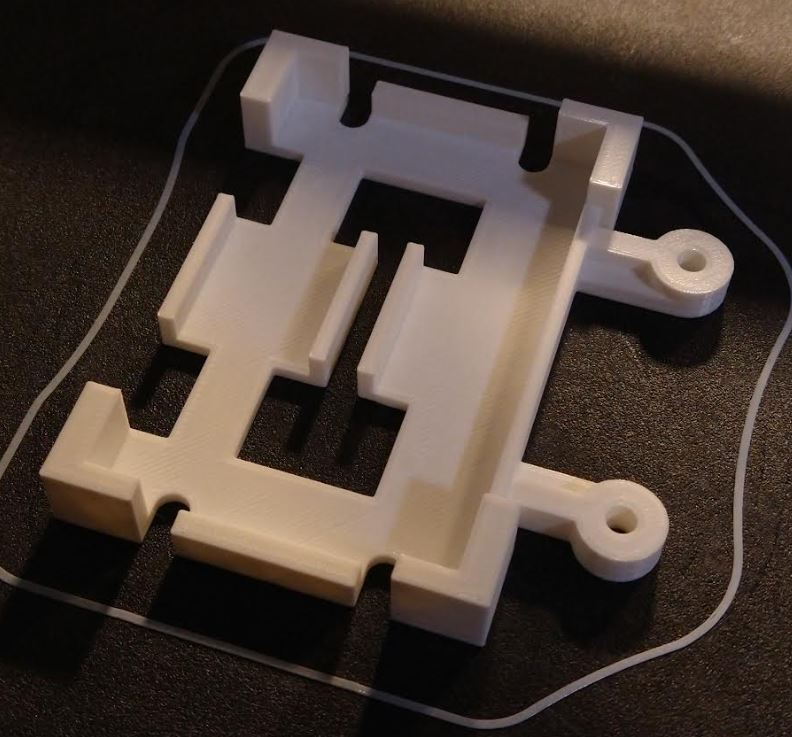

5:03 PM

started printing after reworking the design

I took the TLR's battery section from the servo chasis and just doubled it... it's lazy

I spent some time trying to remove the double middle layers but ehh... anyway it increased the print time by an 8th

So I'll get back on the Pi 4B modeling... feeling lazy and tired right now though

5:18 PM

I got a 40 pin raw male header to temporarily plug the current pins of the Pi into

Makes it easier to measure the bigger parts of the Pi 4B

I'd like to start printing by tomorrow but probably won't happen, need to do more designing

The other thing I'm concerned about is that the camera doesn't sag (not level with horizon)

So that might need some experimenting

lol I took this crappy pic on purpose, the sun setting just right

5:35 PM

yeah... I'm lazy af right now

All I gotta do... print/assemble the battery pack (with a switch) and model the Pi 4B

6:11 PM

I'm working on it, slow... gotta get the dimensions right

I'm only modeling the specific main dimensions I need to design a case around it

I'm feeling lazy so I'm just going to treat the USB/ethernet side as an entire block

6:43 PM

uhuh (crying sound)

it's so ugly... I don't know where to put the speaker, oh well

here you can see whatever this parts box design turns out to be, has to attach to this somehow, then the whole thing attaches to the two-hole mount for the hat bolts.

7:26 PM

overall this will still be a nasty box of rat's nest wires

I'm not really trying to make it look amazing... I was thinking about making it look vintage somehow

ooh it just finished...

this looks so good

need to assemble it, not too much work

I'll finish the body design tomorrow and start printing... I'm not sure if I'll be able to do it all over the weekend I will try, it depends how late I sleep in ha (can't print too late at night)
