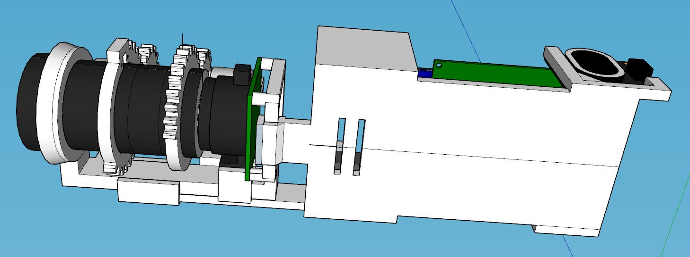
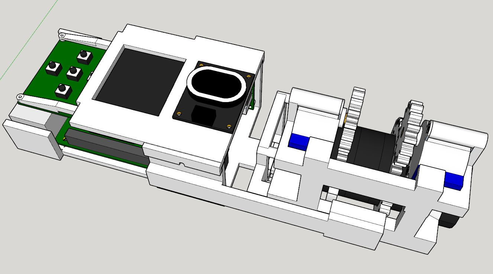
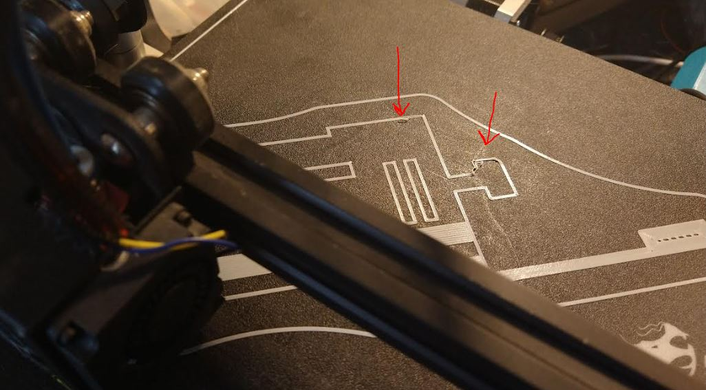
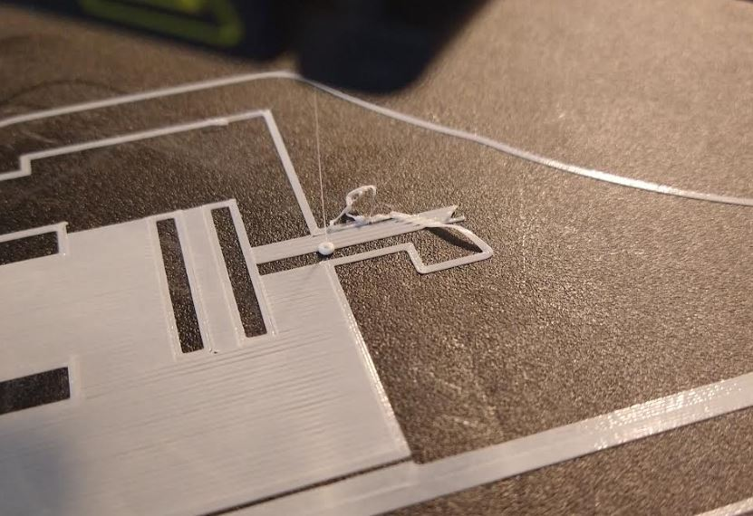

11:07 AM

slow start, I was able to get up earlier today

I'm trying to decide how the two halves (rpi body and lens) will join together

weight balance is a concern

so the camera points level not up/down

11:16 AM

The lens/stepper set is the heaviest so the mounting bolts will have to be near it

Thing is I don't know how much the plastic case wil weigh but it's probably negligible compared to the lens/stepper assembly

9.7oz - stepper assembly

4.5oz - electronics

so yeah it's more than double the weight

so the bolts will be more on the lens side than the electronics

it's good to print it in three parts so you have smaller chunks of work to do

11:33 AM

man this thing is super ugly

12:08 PM

man this is a lot of material

But I need it to be strong

I think I will make the clip separate... because it needs to be adjustable

That middle piece there will be the gravity-slide on area that goes into a U holder

Assuming that is the center of gravity

12:26 PM

I'm at that point again where sketchup lags 5 seconds per action it's rough

But I have not put the time to learn Fusion yet

12:56 PM

omg... this takes so long... damn

and if I get it wrong I have to reprint again

1:18 PM

okay... I'm going to start double checking and then start the bottom print

I moved the speaker to the right since there is room for it

the right-most dpad button is kind of squished but I think there is enough room to push it

2:10 PM

6hr print for the bottom half, had to turn it diagonal to fit on the bed it's 8" long

2:32 PM

started printing, big prints like this make me nervous, I already see issues

I'm still wrapping up some of the bottom/top design stuff but I'm going to work on the d-pad and oled programming while I wait for the print

reeeeeeeeeeeeee yeap it screwed up....

I gotta ram the nozzle into the bed due to sagging

