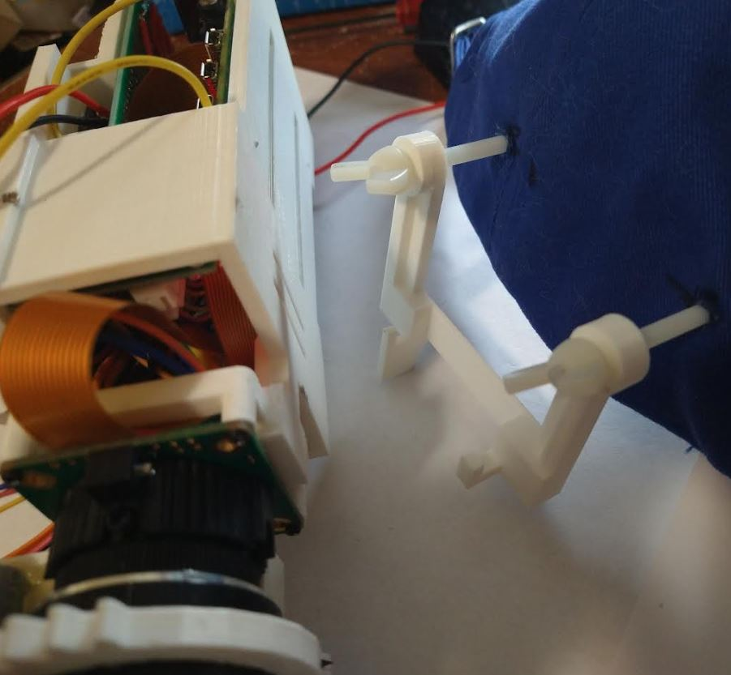

9:54 AM

let's goooo I woke up early today

I had to prepare coffe, shower, eat breakfast... all that

ready now

going to attach the electronics to the bottom case, already printing the top case

10:49 AM

I'm working on shortening the wires but the focus stepper isn't working for some reason

has power... correct wires...

10:56 AM

bad power connection, crappy soldering on my aprt

11:10 AM

ehh... I just folded the wires... I don't want to shorten 16 wires+

11:26 AM

I gotta... drawing a blank

I have to model the hook thing still

Oh I need to determine the run time of this thing... I'll just set it on the side somewhere and have it fire a CRON job every 5 minutes/write a log until it dies

Then when it boots the question of "charged" comes up, no... continue counting down from previous battery logs (have to write to DB)

the center of gravity is at the base of the camera roughly it turns out... so I'm designing a "hook" thing with a couple of points for stability

total unit weight is...

15.6 oz (electronics)

4.6oz (batteyr pack)

so together it's under 1.5 lbs

11:32 AM

waiting for the print

11:53 AM

assembled, still need the hanging hook/mount to hat

12:21 PM

gotta design and print the hanger

I just noticed when you attach the USB mic to it, it's pretty heavy/makes it back heavy

so the hanger has to have more than one point to fight moment arm

12:28 PM

still distracted, I'm admiring this beast lol

12:32 PM

what I'll do is hook onto the... this is not really smart... but I'll hook onto the camera screw as the main hook point, towards the forward bolt and then the back bolt will hook onto one of the heat slots

issue is they're not that wide the slots... I'll go for wide and double

oh... I just had an idea... you can align the camera left/right using spacers on the bolts

1:18 PM

ehh... something like this

will see how it works with the hanging/CG issues

1:40 PM

the first mount design might be too thin... I don't trust it

I would probably cry if this thing fell and broke... so much time wasted

it only takes an hour to print the mount so it's not too bad to do again

2:39 PM

first print is bad, too thick, too thin

5:20 PM

good god I undersetimated how heavy this thing is against your head... it's like a brick attached to your temple lmao

5:45 PM

ahh... I'm sad... after all that work, the whole thing is invalidated because of how ridiculous it looks

Not that it matters I fly alone in a little secluded area

I have another version of it in mind, tri-pod version but that'll be later maybe if I pursue it

I'll see this one through, involves me fixing my broken DLG, waiting for warmer weather and actually doing the ML stuff

I had to cut down the middle piece for the hanging piece

5:58 PM

I do want to see how it performs video recording wise

I'm mentally spent though, also waiting for the batteries to charge, they were completely drained
