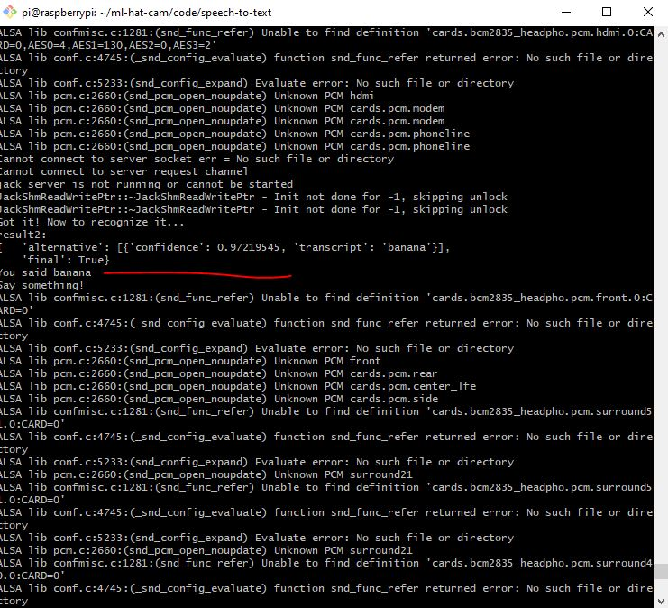

5:14 PM

Okay... so I'm standing there (I realize)

No the field...

Look at how sharp this plane is the knife-edge carbon wings

Do you see the problem in filming my plane by myself

This is what the camera needs to be trained on

So it finds the plane (could be a buzzard) and zooms into it to try and achieve 1/3 frame, meanwhile the autofocus will keep it sharp

I have to take the frame sampling into a thread so it doesn't affect write to USB

Before I get to the ML part, I have to record footage... I have some time before it's flying time... I won't make the mistake again of flying while there's mud on the ground, that's how I broke this plane in half last time I slipped during launch

5:30 PM

ahh... damn sidetracked...

anyway I will get vocal commands working so I can say "zoom in, zoom status" that kind of thing

that'll work for recording the initial footage

I'm going to setup the time tracking/menu thing too since I would rather not kill the hat cam to not stress the batteries

5:39 PM

ahh I'm feeling tired

5:42 PM

what can I do right now that's not that hard?...

database

also a menu splash screen/play the sound

I'll manually generate the audio files for now

I'll set the low battery warning against an uptime of 5.5 hrs

5:49 PM

the term is offline speech to text, looks like Mozilla DeepSpeech is good

I see something for microphone too with alsa

https://forums.raspberrypi.com/viewtopic.php?t=275910

https://www.seeedstudio.com/blog/2020/01/23/offline-speech-recognition-on-raspberry-pi-4-with-respeaker/

built into pip nice

so yeah a nearby goal is to control the steppers with voice eg. "zoom in" "zoom in" "zoom out"

feedback would say "maximum zoom"

6:02 PM

I'm going to screw around with this deepspeech thing

I need to build that db battery tracking thing but ties into menu

I want a splash screen when it boots, little image/logo shows up

oh yeah I need to count the lines from the CRON job though I already know the answer

69 * 5 so 5.75 hrs

6:10 PM

distracted

gotta find the usb mic

looking at this

https://github.com/touchgadget/DeepSpeech

6:22 PM

good link

https://discourse.mozilla.org/t/error-installing-deepspeech-on-raspberry-pi-4/91003/2

damn... my OS/platform is not supported

6:32 PM

trying another one

https://forums.raspberrypi.com/viewtopic.php?t=330490

this stuff is not for money but I see GPL licenses

https://github.com/Uberi/speech_recognition

there is a note about usb mic

device_index=1

ml-hat-cam facing me, it's in slot 1, towards back, non-usb-3

6:42 PM

ooh... this is working... it's dumping a lot of nasty logs but I can thread it and filter out the command

then catch problems

6:47 PM

I need to see it's resource usage as it runs as a thread on the side

it can also crash I noticed, this lock thing

6:55 PM

I don't think I was using offline mode in the example

adding pocketsphinx now which is by carnegie mellon nice

6:57 AM

the accuracy is bad

well... this is where I'd train my own model and speak a bunch of times, training it myself would be cool and also only needs to know a few phrases

but this is a good starting point and has to be offline/on the edge

lmao I say banana it says lenin

zoom in = demon

damn

might have to go with vosk

7:07 PM

the bendy mic is not long enough/can't break ambient sound threshold

good thing I bought the wired one

it'll be interesting because I need to record this audio to disk and also use it for STT

it's so bad... maybe it's the mic, need to record audio sample to local

7:17 PM

sound recorded is not terrible

this is not gonna work... sphinx is so bad

trying the small us model

https://alphacephei.com/vosk/models

not sure where to put it

lmao

RTFM

"Vosk thinks you said Vosk thinks you said Please download the model from https://github.com/alphacep/vosk-api/blob/master/doc/models.md and unpack as 'model' in the current folder.`

I downloaded a zipped model, gotta move it in here

/home/pi/ml-hat-cam/code/speech-to-text

I need to not track this... in case any issues idk

this library is not for sale so I think I'm good... it's apache licensed

/home/pi/ml-hat-cam/code/speech-to-text

7:40 PM

man... these are not usable

they are either inaccurate or don't work

the online model works... damn

hmm.... might need an alternative plan here... if voice control doesn't work

I am down to train my own but I have no idea how long that would take to learn

hmm...

I'm going to look into this

https://www.tensorflow.org/tutorials/audio/simple_audio

I just need to train my own commands

