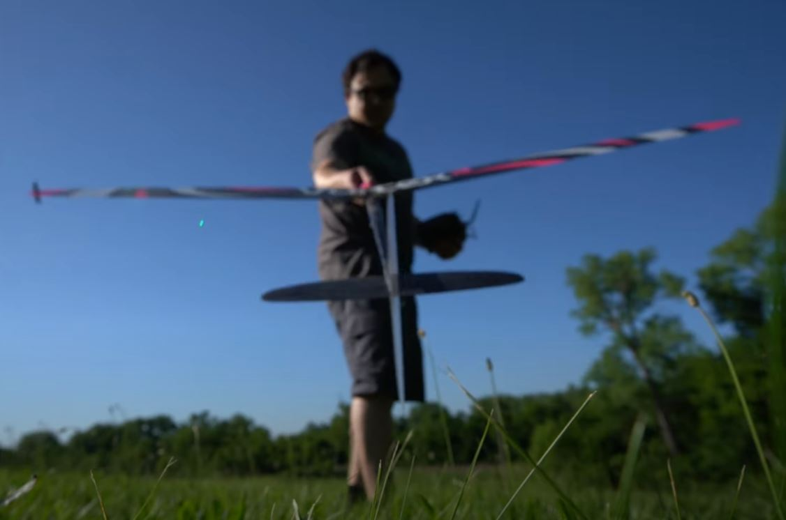
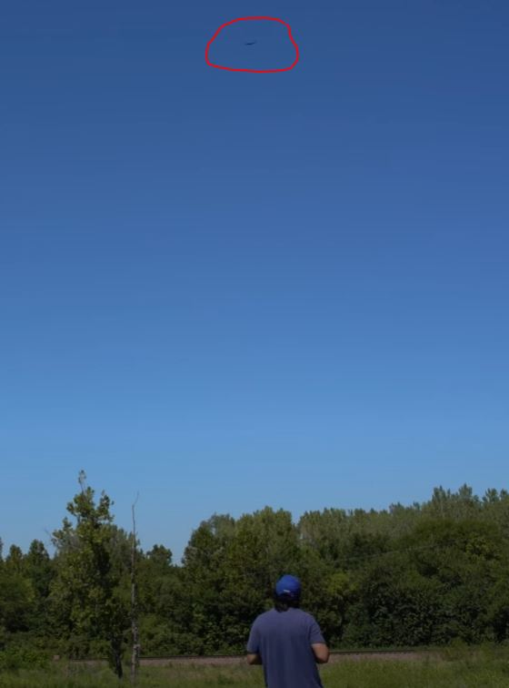
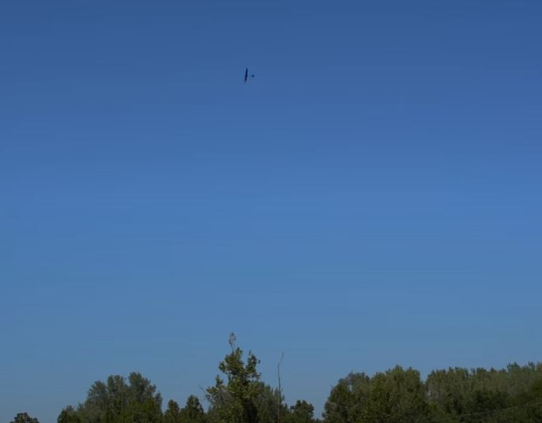

5:14 PM

Okay... so I'm standing there (I realize)

No the field...

Look at how sharp this plane is the knife-edge carbon wings

Do you see the problem in filming my plane by myself

This is what the camera needs to be trained on

So it finds the plane (could be a buzzard) and zooms into it to try and achieve 1/3 frame, meanwhile the autofocus will keep it sharp

I have to take the frame sampling into a thread so it doesn't affect write to USB

Before I get to the ML part, I have to record footage... I have some time before it's flying time... I won't make the mistake again of flying while there's mud on the ground, that's how I broke this plane in half last time I slipped during launch

5:30 PM

ahh... damn sidetracked...

anyway I will get vocal commands working so I can say "zoom in, zoom status" that kind of thing

that'll work for recording the initial footage

I'm going to setup the time tracking/menu thing too since I would rather not kill the hat cam to not stress the batteries

