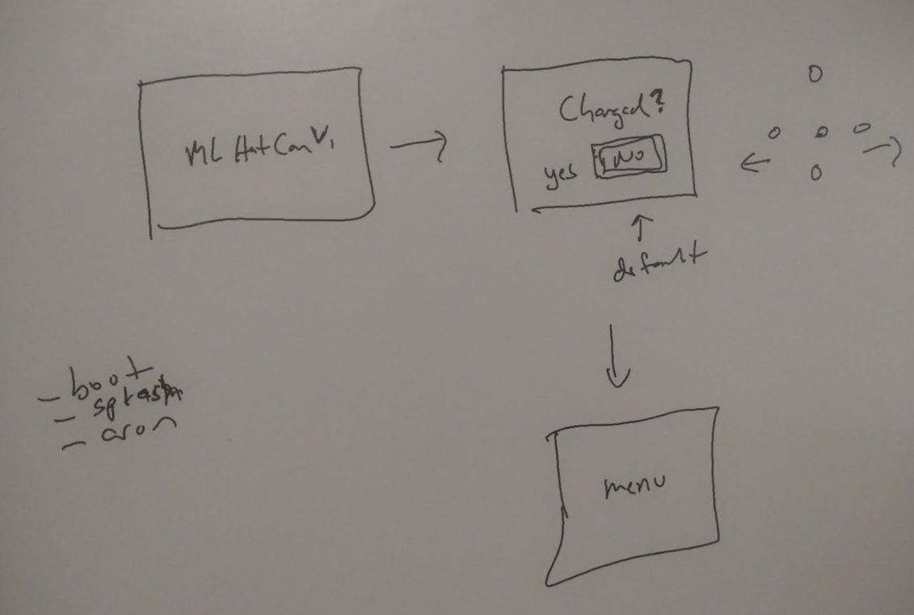

5:54 PM

I feel like crap today, headache, passed out for half an hour

I came across porcupine/picovoice

I think that approach makes sense eg. wake/intent since I will be recording audio while recording video... and then the voice command fires

I only need like 6 phrases so I can train those myself if needed

I gotta look into it more...

I'm going to work on that boot/battery logging system

It'll be easy, cron-based... will figure out what I did for the pi zero 2 navigation sensor thing

6:03 PM

haven't started yet

6:39 PM

yeah idk what's up with me feel pain in my eyes lol

6:44 PM

yeah this workflow here

- boot runs this menu display process:
  - show splash screen
  - ask if charged
  - main menu

button listener has to be waiting
basic menu laid out, active option has box around it

every 5 minutes increment DB entry

means I could estimate battery life (percentage) and show on menu

7:00 PM

yeah I feel like dog shit right now

https://github.com/Picovoice/porcupine

https://picovoice.ai/

well I had an idea anyway, stuff to do next

I gotta figure out how I did the boot script on the pi zero 2 nav

7:18 PM

I will achieve something today, the boot/menu is easy

9:52 PM

I will draw the basic charged? menu

oh the boot stuff was done with systemd

ehh... I'm kind of tired/beat

I'll do something simpler, just having a boot script set the splash screen

the menu thing I gotta think about coordinates

10:14 PM

ugh... I have a dependency problem... I need to import/relate a folder in one class and also import in another

10:19 PM

forget it... I'll just have the boot.py in root

10:22 PM

system d script didn't work

10:46 PM

nice, working post boot splash text scene
