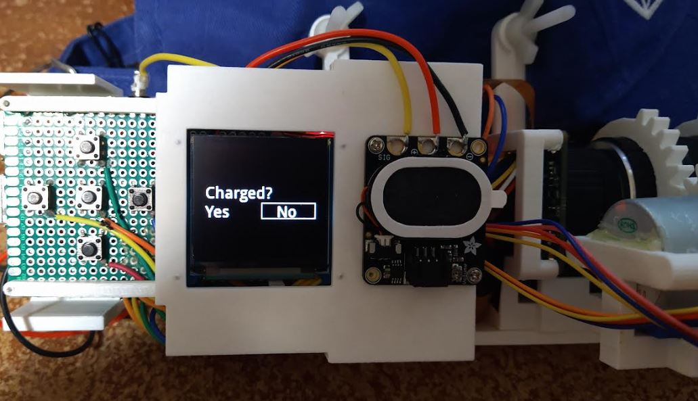

5:54 PM

another shit day... I might be burning out idk

going to get something done though

I have not played video games for like an entire month, just been working on this on my free time

I can't watch movies anymore idk... can't pay attention that long

so tired of being a worker too, not free for a large chunk of time

I have to escape, free myself, but I'm trapped for now

I am looking forward to spring where I can take this out with my plane

I'm going to:

- center the intro text

- Create the yes no option

- bind the buttons

- db to store up time

not sure how far I can get but I'll try

6:13 PM

spacing out lol

oh yeah I forgot, I was thinking of a menu builder based on JSON nesting

6:31 PM

need automatic portion dividing too

6:34 PM

yeee

the display is 128x128 and the letters are 18 tall so yeah... that's how you split it up

it's 0-based too so 0-127

unfortunately each part is drawn one at a time

6:41 PM

need a menu state

6:48 PM

ugh... man

if you hit left, you have to redraw the right square first, as no fill

then draw the left square

6:54 PM

ooh man just has an idea, send in a callback when a button is pressed yeeee

6:58 PM

it is faster to just change colors of text... vs. drawing 4 parts of a square, undrawing = 8 steps

