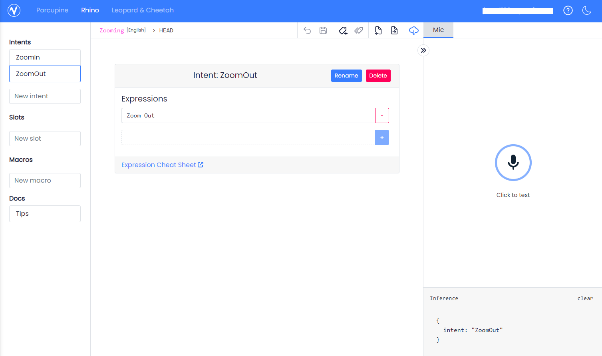

11:04 AM

new day, going to work on the voice stuff again since it's the hardest between that and menu stuff

11:13 AM

alright let's go... my local goal is to record a video showing the voice-triggered zoom/zoom out with statuses

11:24 AM

alright... made an account with picovoice.ai

it looks like that github repo is literally for the word "porcupine"

so I have to train my own stuff for:

- zoom in
  - responds (middle zoom)
  - responds (max zoom)
  - responds max zoom (does nothing)
- zoom out
  - responds (middle zoom)
  - responds (zoomed out) does nothing if already zoomed out

I only need those two bare minimum

looks like I want speech to intent

Using Rhino, going through their interface

I don't really understand what's happening... it seems to already work

okay so I donwload the modle (cloud icon)

the zoom out one sometimes triggers zoom in... that's not great

I don't see the training part though, it's not like "say it again and again" it just says "click to test"

well whatever let me get the model onto my rpi

11:50 AM

I don't understand why you need a key if it's offline (no internet)

12:06 PM

have an alsa problem

I'm almost tempted to say f it and skip voice control for now and use the buttons to zoom in/out

in the end I want to make my own models but that requires time

12:10 PM

okay... I got it working, had to specify device index

I will try it offline now

the microphone distance is great

the speaker emits this annoying sound sadly

I need to turn it on/off

12:32 PM

so I tried it offline and it does work

I turned the wifi off and used it

the issue is the speaker goes nuts... this whining sound... I have to turn off sound output somehow

I may need like a switch/mosfet type to literally stop the speaker from making noise which sucks because it's unplanned

12:42 PM

still trying to find a way to disable volume

12:48 PM

I'll just run that demo code as a thread with a way to kill it, run while recording video

1:43 PM

thankfully I was able to figure out the speaker issue

okay so at this point I have to integrate this sound intent thing into my mechanical code

the lazy way is to read the output (console output)

the better way is to modify the source code and pass the class instance reference in before the code starts working eg. kwargs or whatever

1:50 PM

let's do it, for the gram baby

2:32 PM

what's bad about the approach I'm doing is the build up in stdout/memory usage

2:48 PM

ugh... this is not going well

I'll just modify the source and call it there

ehh.... I'll keep trying

2:58 PM

it's not working...

I will have to read through the code and modify the class example

3:12 PM

damn it, path problems again

I'll consolidate the code into one file

3:38 PM

stuck on not being able to read env file

3:39 PM

jeezus... it's working

3:41 PM

at this point the code is nasty in terms of organization

I will have to rework it, but I can do my voice stepper demo

3:46 PM

I put a stop thing in the pico code so that's how you would stop it between recording sessions

4:24 PM

it's working but there is an overflow issue which makes the picovoice stop working for a bit

also sucks I'm setting exact positions for the stepper, should be auto

but I need the manual commands

4:29 PM

batteries died

I need to clean the lens too sucks... gotta take it apart

4:37 PM

It is actually useful to manually control it besides launch with regard to recording the training footage

I'm not sure how long to wait before I try to fly, I'm excited for it but I gotta wait till the ground is more dry

Also have to fix the glider still

4:44 PM

right now the battery monitor isn't working due to the LCD paint ordering issue

so I am not paying attention to how long the pi lives

until I fix that
