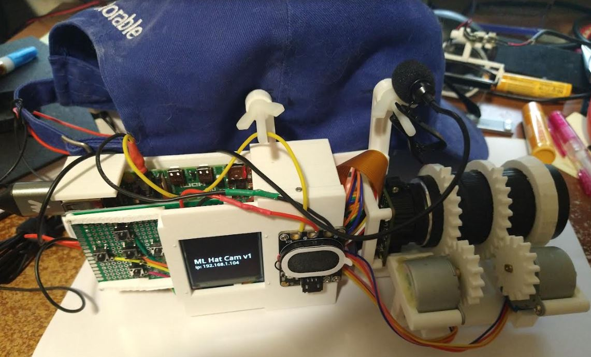
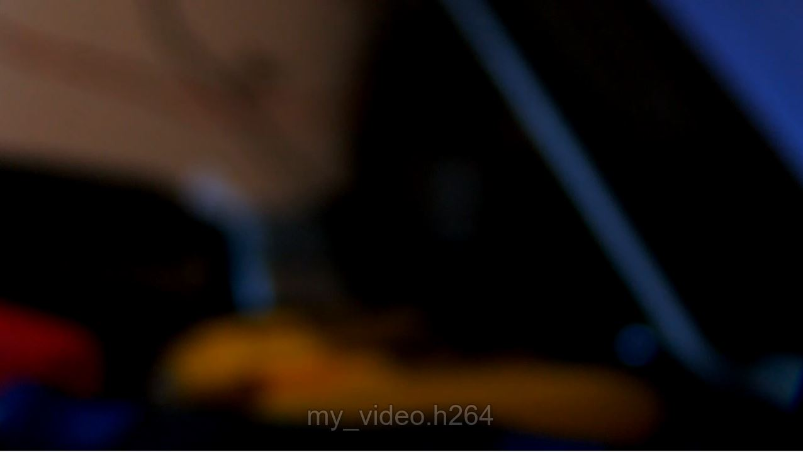

7:53 AM

Ahh man I woke up way too early for some reason...

Anyway nexus point in life, another tech job or labor

Either way time moves on... I realized since most jobs now are against being remote I won't have the opportunity to visit the park on weekdays/will be gone 9-5 M-F entire days...

So I gotta get this thing working/take it out to the field tomorrow (nice weather)

I fixed the Vortex 3 already, I crashed it again... the radio went dead or something as it just went into a flat dive, I wasn't even that far away or high up so it was odd... I'm thinking the battery I was using was bad?... I need to test them pull 300mA and see if they can sustain it, that's half the current rating of the battery

Things I need to address immediately:

- record to USB
- setup record button
- fixed focus
  - tie to voice command
- fix autofocus

I have a hunch on what to do (take the buffer stream and write to to a file) but not sure how

https://raspberrypi-guide.github.io/electronics/image-and-video-recording#pirecorder

well it's built into the picamera module

of course in this case it's put into a video stream vs. to file

I probably can write a separate file to do camera recording stuff, although I still need to extract frames to do autofocus... which I want bare minimum, actually use it as a video camera

So just focus on writing to file and photo is in focus (preview on OLED is too much work)

yeap... nice company I left like a dummy, six figs to nothing

8:12 AM

Distracted, saw someone starred a repo of mine, updated readme

The hat cam may die soon since I haven't charged it lately... I can still keep going with a single battery I have on the side while the two main ones charge.

Parallel batteries is cool and each cell is protected

I think there is a pretty good size SD card on the RPi but I'm trying to avoid using it due to shortening its life span

8:20 AM

still distracted... okay write to file

this is a 128GB sd card

`lsblk` shows the 32GB USB drive as `/dev/sda` probably

8:25 AM

hmm... I should find a way to mount the remote volume (RPi) into vscode

so I write code in both places

8:36 AM

lol would think this is obvious but I guess not

https://forums.raspberrypi.com/viewtopic.php?t=332681

OS GUI makes it easy

oh okay it's not bad, need sudo and then the `/mount` path is the actual path you use to write with

looking at this too

https://datasheets.raspberrypi.com/camera/picamera2-manual.pdf

ooh... let's see our first video

Nice

8:48 AM

the use of sudo is not great, looking into it

https://stackoverflow.com/questions/3738173/why-does-pyusb-libusb-require-root-sudo-permissions-on-linux

hmm so far not working

where did I put the systemd stuff, maybe it's already running as root

it's in /etc/systemd/system/boot_ml-hat-cam.service

nope it's pi user dang

8:59 AM

well... lazy fix but gotta get it done/personal project

so it's

- mount usb
- record video

the audio control is off right now

I don't have audio recording

for the moment I won't use... I'm not sure if the audio stream can be listened to by multiple things... probably

but for now I will not use the voice control, will use dedicated audio recording... will sync by visual reference eg. snapping fingers

then merge post process... this thing just needs to work...

I will pre-program close, mid, far range zooms then have a menu to trigger those and start/stop recording

I'm trying to get bare minimum stuff functional here because I will go tomorrow

I'm tired right now and can't really do anything challenging

I got fast food yesterday and I'm coughing... hope I didn't catch a bug, hoping it's just low sleep

9:04 AM

https://makersportal.com/blog/2018/8/23/recording-audio-on-the-raspberry-pi-with-python-and-a-usb-microphone

looks straightforward to record audio

my USB is either 3 or 0, I think it's 3

not sure how to read this `(hw:3, 0)`

USB Lavalier Microphone

I'm mostly using this audio code as is since it's a lot of definitions

9:17 AM

holy crap that's not bad! listening to some I Mother Earth

I need the entire process still

I could change zoom while recording... reach up and push the button lol

play a sound

so... push record, zoom settings displayed

up/down to change

the menu thing is not easy to work on since it's tied to existing boot code... it's one file though but yeah, gotta go in there, figure all that out, tie to code

still need to do the lense focusing

default to wide open/close

9:24 AM

hmm... this is going to take some work

do the hardest stuff first... as brain deteriorates

9:33 AM

I might have broken something with recent changes, boot wise anyway

probably the root systemd change

9:39 AM

oh I see... switching users packages are missing

10:03 AM

quick food break back on

I didn't set the "charged" option to yes so it said "low battery" ha that's cool

trying to figure out the easiest thing to do here, I still have to do those presets

button to record

main button says start

10:32 AM

another brief break

Okay the state is pretty easy

- start/stop record
  - close, middle, far

so you hit "start", goes into the second step with those three options

I had to sell my RM2 so sad... but I have a galaxy book 4K with a pen, will see how that goes

I also want to set the percentage to hours/minutes at some point

it's around 6 hours of battery life if I remember

oh man... the arrows are fixed bound right now

all the menu items are manually drawn

well I can expand on the `parse_dpad()` listener

hmm dMenu also doesn't seem abstract enough/general purpose

10:57 AM

man I'm tired... trying to finish this today but could take an hour or two tomorrow morning worst case

11:12 AM

display is bugging out

weird refresh

the code running on the display is cached it seems... wonder if it's from the boot script

I could disable it temporarily

copy

`sudo systemctl disable boot_ml-hat-cam.service`

11:18 AM

okay it's working correctly now

11:21 AM

okay I'm going to get the menu system working

then write the actual code to move the steppers to position

I figured out the values before but I'll have to get them again... (steppers may have moved)

means watching live stream, keeping focus far distance (high f number)

then add wrappers to the video/audio recorders... bind to the buttons

should be done?...

I can merge the audio in kdenlive, you could use ffmpeg/do it on rpi

11:41 AM

damn it's stuck on far

