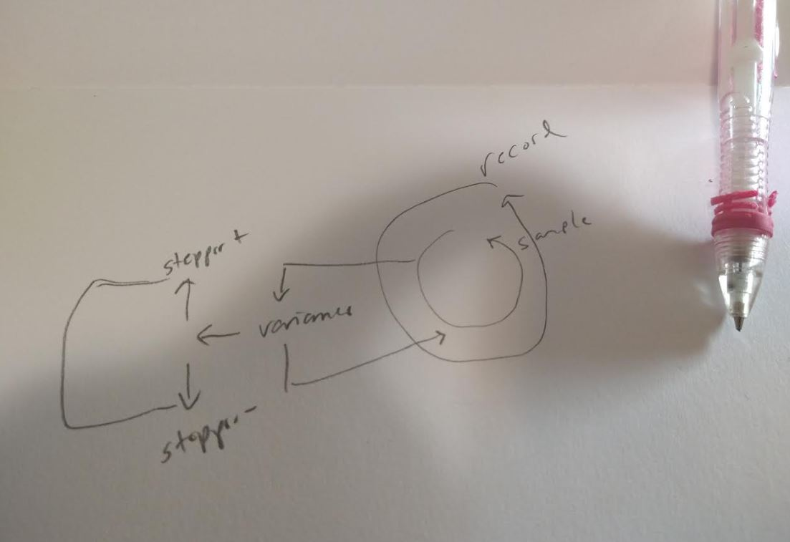

06/08/2023

4:21 PM

Ahh... I'm kind of not feeling it but need to try

- [ ] use video recording with buffer stream
  - [ ] apply variance for auto focus
    - [ ] factor in pre-calibrated distances
      - [ ] check focuses regarding fstop
- [ ] fix audio recording
- [ ] restructure code to factor in voice control
- [ ] test at home for several minutes

4:28 PM

I feel like I can take the web stream code apart and pull the buffer part (what I want)

I've seen an example of picamera2 though with video recording where it had a buffer... hopefully it's not just for preview

4:42 PM

struggling...

4:54 PM

hmm... looks like audio recording is built into picamera2 will see, that would be convenient

looks like the boot script blocks camera access

5:01 PM

dumb... don't open YouTube distraction

hmm broken pipe tried recording sample with audio

still_during_video.py this could be something

5:07 PM

I feel like I should be able to take the web stream code and pull the server aspect out... write to USB instead (while intercepting frames in another thread)

hmm... maybe I do want to just pull frames out while recording not sure of performance

5:28 PM

I'm thinking something like this for the video recording autofocus control loop

there's the recording bit, then a sampling thread that's checking variance with access to stepper control (focus ring)

my variance algo sucked so I still have to come up with something for that

5:49 PM

ugh... something wrong with my usb drive status 32

will use gparted maybe...

I don't like this how the USB is problematic, it worked fine last time but that's a show stopper

Can't write to USB... can write to SD card but reduces life span

Ohh... I forgot you need sudo to use the USB drive... will write a try catch error message with that for a reminder

5:59 PM

just had a thought while I was having a snacky snack, there needs to be a variance interrupt thing while changing zoom levels eg. near/mid/far, so the focus zoom set for each of those ranges isn't interrupted

6:04 PM

installing opencv

weird that it's not on here already...

6:23 PM

distracted by PT2 not working

